# Summary
<ins>result</ins> is better

| Benchmark | This PR | baseline |
|---|---|---|
| api_overhead_benchmark_sycl SubmitKernel out of order | 24.266 | <ins>23.553</ins> |diff:97.1%
| api_overhead_benchmark_sycl SubmitKernel in order | 24.068 | <ins>23.258</ins> |diff:96.6%
| api_overhead_benchmark_ur SubmitKernel out of order | 15.749 | <ins>15.717</ins> |diff:99.8%
| api_overhead_benchmark_ur SubmitKernel in order | 14.754 | <ins>14.502</ins> |diff:98.3%
| memory_benchmark_sycl QueueInOrderMemcpy from Device to Device, size 1024 | 244.11 | <ins>236.808</ins> |diff:97.0%
| memory_benchmark_sycl QueueInOrderMemcpy from Host to Device, size 1024 | 117.223 | <ins>116.896</ins> |diff:99.7%
| memory_benchmark_sycl QueueMemcpy from Device to Device, size 1024 | <ins>6.024</ins> | 6.273 |diff:104.1%
| memory_benchmark_sycl StreamMemory, placement Device, type Triad, size 10240 | 3.062 | <ins>3.025</ins> |diff:98.8%
| api_overhead_benchmark_sycl ExecImmediateCopyQueue out of order from Device to Device, size 1024 | <ins>2.267</ins> | 2.692 |diff:118.7%
| api_overhead_benchmark_sycl ExecImmediateCopyQueue in order from Device to Host, size 1024 | <ins>1.779</ins> | 2.043 |diff:114.8%
| miscellaneous_benchmark_sycl VectorSum | <ins>941.955</ins> | 1009.586 |diff:107.2%
| Velocity-Bench Hashtable | 305.024214 | <ins>378.511351</ins> |diff:80.6%
| Velocity-Bench Bitcracker | <ins>18.6015</ins> | 18.9006 |diff:101.6%
| Velocity-Bench QuickSilver | 122.09 | <ins>137.85</ins> |diff:88.6%
| Runtime_BlockedTransform_iter_64_blocksize_256 | 0.111 | <ins>0.106</ins> |diff:95.5%
| Runtime_BlockedTransform_iter_128_blocksize_256 | 0.081 | <ins>0.08</ins> |diff:98.8%
| Runtime_BlockedTransform_iter_256_blocksize_256 | 0.06899999999999999 | <ins>0.06499999999999999</ins> |diff:94.2%
| Runtime_BlockedTransform_iter_512_blocksize_256 | 0.068 | <ins>0.060000000000000005</ins> |diff:88.2%
| Runtime_IndependentDAGTaskThroughput_BasicParallelFor | 2.863 | <ins>2.8089999999999997</ins> |diff:98.1%
| Runtime_IndependentDAGTaskThroughput_NDRangeParallelFor | 2.794 | <ins>2.7369999999999997</ins> |diff:98.0%
| Runtime_IndependentDAGTaskThroughput_HierarchicalParallelFor | 2.8240000000000003 | <ins>2.765</ins> |diff:97.9%
| Runtime_IndependentDAGTaskThroughput_SingleTask | 2.84 | <ins>2.799</ins> |diff:98.6%
| Runtime_DAGTaskThroughput_NDRangeParallelFor | 2.193 | <ins>2.1510000000000002</ins> |diff:98.1%
| Runtime_DAGTaskThroughput_SingleTask | 2.2659999999999996 | <ins>2.193</ins> |diff:96.8%
| Runtime_DAGTaskThroughput_HierarchicalParallelFor | 2.198 | <ins>2.165</ins> |diff:98.5%
| Runtime_DAGTaskThroughput_BasicParallelFor | 2.261 | <ins>2.218</ins> |diff:98.1%
| MicroBench_LocalMem_fp32_4096 | <ins>0.183</ins> | 0.183 |diff:100.0%
| MicroBench_LocalMem_int32_4096 | 0.19 | <ins>0.189</ins> |diff:99.5%
| MicroBench_L2_int32_8 | <ins>0.01</ins> | 0.01 |diff:100.0%
| MicroBench_L2_fp32_8 | <ins>0.01</ins> | 0.01 |diff:100.0%
| MicroBench_L2_fp32_16 | 0.012 | <ins>0.011</ins> |diff:91.7%
| MicroBench_L2_fp32_2 | <ins>0.01</ins> | 0.01 |diff:100.0%
| MicroBench_L2_fp32_4 | <ins>0.01</ins> | 0.01 |diff:100.0%
| MicroBench_L2_int32_4 | <ins>0.01</ins> | 0.01 |diff:100.0%
| MicroBench_L2_int32_16 | <ins>0.012</ins> | 0.012 |diff:100.0%
| MicroBench_L2_fp32_1 | <ins>0.01</ins> | 0.01 |diff:100.0%
| MicroBench_L2_int32_1 | <ins>0.015000000000000001</ins> | 0.015000000000000001 |diff:100.0%
| MicroBench_L2_int32_2 | 0.011 | <ins>0.01</ins> |diff:90.9%
| Pattern_Reduction_NDRange_int32 | <ins>0.028</ins> | 0.028 |diff:100.0%
| Pattern_Reduction_Hierarchical_int64 | <ins>0.047</ins> | 0.049 |diff:104.3%
| Pattern_Reduction_Hierarchical_int32 | <ins>0.046</ins> | 0.047 |diff:102.2%
| Pattern_Reduction_NDRange_fp32 | <ins>0.020999999999999998</ins> | 0.020999999999999998 |diff:100.0%
| Pattern_Reduction_NDRange_int64 | <ins>0.023</ins> | 0.023 |diff:100.0%
| Pattern_Reduction_Hierarchical_fp32 | 0.048 | <ins>0.047</ins> |diff:97.9%
| ScalarProduct_NDRange_fp32 | <ins>0.034</ins> | 0.034 |diff:100.0%
| ScalarProduct_Hierarchical_int32 | 0.057 | <ins>0.056</ins> |diff:98.2%
| ScalarProduct_NDRange_int32 | 0.044 | <ins>0.043000000000000003</ins> |diff:97.7%
| ScalarProduct_NDRange_int64 | 0.04 | <ins>0.039</ins> |diff:97.5%
| ScalarProduct_Hierarchical_fp32 | <ins>0.055</ins> | 0.055 |diff:100.0%
| ScalarProduct_Hierarchical_int64 | 0.059 | <ins>0.058</ins> |diff:98.3%
| Pattern_SegmentedReduction_NDRange_int32 | <ins>0.014</ins> | 0.014 |diff:100.0%
| Pattern_SegmentedReduction_Hierarchical_int32 | 0.027 | <ins>0.026</ins> |diff:96.3%
| Pattern_SegmentedReduction_NDRange_int16 | <ins>0.019</ins> | 0.019 |diff:100.0%
| Pattern_SegmentedReduction_NDRange_fp32 | <ins>0.012</ins> | 0.012 |diff:100.0%
| Pattern_SegmentedReduction_NDRange_int64 | <ins>0.014</ins> | 0.014 |diff:100.0%
| Pattern_SegmentedReduction_Hierarchical_int16 | <ins>0.028</ins> | 0.028 |diff:100.0%
| Pattern_SegmentedReduction_Hierarchical_fp32 | 0.030000000000000002 | <ins>0.029</ins> |diff:96.7%
| Pattern_SegmentedReduction_Hierarchical_int64 | <ins>0.028</ins> | 0.028 |diff:100.0%
| USM_Latency_fp32_out_of_order__ | 24.969 | <ins>24.468</ins> |diff:98.0%
| SYCL2020_Accessors_Latency_fp32_out_of_order__ | 36.651 | <ins>35.857</ins> |diff:97.8%
| USM_Latency_fp32_in_order__ | 17.262 | <ins>17.033</ins> |diff:98.7%
| SYCL2020_Accessors_Latency_fp32_in_order__ | 35.016 | <ins>34.585</ins> |diff:98.8%
| USM_Allocation_latency_fp32_shared | <ins>0.041</ins> | 0.041 |diff:100.0%
| USM_Allocation_latency_fp32_device | <ins>0.003</ins> | 0.003 |diff:100.0%
| USM_Allocation_latency_fp32_host | <ins>0.0</ins> | 0.0 |
| USM_Instr_Mix_fp32_host_1:1mix_no_init_no_prefetch | 1.066 | <ins>1.057</ins> |diff:99.2%
| USM_Instr_Mix_fp32_shared_1:1mix_with_init_with_prefetch | 10.895999999999999 | <ins>10.833</ins> |diff:99.4%
| USM_Instr_Mix_fp32_shared_1:1mix_no_init_with_prefetch | 10.76 | <ins>10.744</ins> |diff:99.9%
| USM_Instr_Mix_fp32_host_1:1mix_with_init_no_prefetch | 0.92 | <ins>0.907</ins> |diff:98.6%
| USM_Instr_Mix_fp32_shared_1:1mix_no_init_no_prefetch | 11.197000000000001 | <ins>10.881</ins> |diff:97.2%
| USM_Instr_Mix_fp32_device_1:1mix_with_init_no_prefetch | 1.522 | <ins>1.417</ins> |diff:93.1%
| USM_Instr_Mix_fp32_shared_1:1mix_with_init_no_prefetch | 11.001999999999999 | <ins>10.936</ins> |diff:99.4%
| USM_Instr_Mix_fp32_device_1:1mix_no_init_no_prefetch | 1.574 | <ins>1.553</ins> |diff:98.7%
| USM_Pinned_Overhead_fp32_DeviceHost_NonPinned_Init_1 | 0.066 | <ins>0.06499999999999999</ins> |diff:98.5%
| USM_Pinned_Overhead_fp32_HostDevice_Pinned_Init_1 | <ins>0.003</ins> | 0.003 |diff:100.0%
| USM_Pinned_Overhead_fp32_DeviceHost_Pinned_Init_1 | <ins>0.011</ins> | 0.011 |diff:100.0%
| USM_Pinned_Overhead_fp32_HostDevice_NonPinned_Init_1 | <ins>0.004</ins> | 0.004 |diff:100.0%
| VectorAddition_int32 | <ins>0.015000000000000001</ins> | 0.015000000000000001 |diff:100.0%
| VectorAddition_fp32 | <ins>0.013</ins> | 0.013 |diff:100.0%
| VectorAddition_int64 | <ins>0.015000000000000001</ins> | 0.015000000000000001 |diff:100.0%
| Polybench_2DConvolution | <ins>0.164</ins> | 0.164 |diff:100.0%
| Polybench_2mm | <ins>0.85</ins> | 0.851 |diff:100.1%
| Polybench_3mm | <ins>1.2570000000000001</ins> | 1.258 |diff:100.1%
| MicroBench_Arith_fp32_512 | <ins>0.019</ins> | 0.019 |diff:100.0%
| MicroBench_Arith_int32_512 | 0.04 | <ins>0.039</ins> |diff:97.5%
| Polybench_Atax | <ins>5.97</ins> | 5.974 |diff:100.1%
| ReductionAtomic_fp32 | 0.02 | <ins>0.019</ins> |diff:95.0%
| ReductionAtomic_int32 | <ins>0.013</ins> | 0.013 |diff:100.0%
| ReductionAtomic_fp64 | 0.020999999999999998 | <ins>0.02</ins> |diff:95.2%
| ReductionAtomic_int64 | 0.014 | <ins>0.013</ins> |diff:92.9%
| Polybench_Bicg | <ins>4.119000000000001</ins> | 4.139 |diff:100.5%
| Polybench_Correlation | <ins>88.07900000000001</ins> | 88.18299999999999 |diff:100.1%
| Polybench_Covariance | <ins>87.445</ins> | 87.478 |diff:100.0%
| Polybench_Gemm | <ins>3.1229999999999998</ins> | 3.1229999999999998 |diff:100.0%
| Polybench_Gesummv | <ins>6.912</ins> | 6.923 |diff:100.2%
| Polybench_Gramschmidt | 270.061 | <ins>269.43699999999995</ins> |diff:99.8%
| Kmeans_fp32 | <ins>1.47</ins> | 1.47 |diff:100.0%
| LinearRegressionCoeff_fp32 | 0.27 | <ins>0.268</ins> |diff:99.3%
| LinearRegression_fp32 | 0.312 | <ins>0.311</ins> |diff:99.7%
| MatmulChain | <ins>9.126000000000001</ins> | 9.126999999999999 |diff:100.0%
| MolecularDynamics | <ins>0.032</ins> | 0.032 |diff:100.0%
| Polybench_Mvt | 3.092 | <ins>3.064</ins> |diff:99.1%
| MicroBench_sf_fp32_16 | 0.009000000000000001 | <ins>0.008</ins> |diff:88.9%
| Polybench_Syr2k | 5.38 | <ins>5.316999999999999</ins> |diff:98.8%
| Polybench_Syrk | <ins>2.4979999999999998</ins> | 2.502 |diff:100.2%
Mean performance: 98.8% of baseline (higher is better)

# Charts

<details>
<summary>api_overhead_benchmark_sycl SubmitKernel out of order</summary>

```mermaid
---
config:
    gantt:
        rightPadding: 10
        leftPadding: 120
        sectionFontSize: 10
        numberSectionStyles: 2
---
gantt
    title api_overhead_benchmark_sycl SubmitKernel out of order
    todayMarker off
    dateFormat  X
    axisFormat %s

    section api_overhead_benchmark_sycl<br>SubmitKernel<br>out<br>of<br>order

        This PR (24.266 μs)   : crit, 0, 24

        baseline (23.553 μs)   :  0, 23

    -   : 0, 0

    -   : 0, 0

```

</details>

<details>
<summary>api_overhead_benchmark_sycl SubmitKernel in order</summary>

```mermaid
---
config:
    gantt:
        rightPadding: 10
        leftPadding: 120
        sectionFontSize: 10
        numberSectionStyles: 2
---
gantt
    title api_overhead_benchmark_sycl SubmitKernel in order
    todayMarker off
    dateFormat  X
    axisFormat %s

    section api_overhead_benchmark_sycl<br>SubmitKernel<br>in<br>order

        This PR (24.068 μs)   : crit, 0, 24

        baseline (23.258 μs)   :  0, 23

    -   : 0, 0

    -   : 0, 0

```

</details>

<details>
<summary>api_overhead_benchmark_ur SubmitKernel out of order</summary>

```mermaid
---
config:
    gantt:
        rightPadding: 10
        leftPadding: 120
        sectionFontSize: 10
        numberSectionStyles: 2
---
gantt
    title api_overhead_benchmark_ur SubmitKernel out of order
    todayMarker off
    dateFormat  X
    axisFormat %s

    section api_overhead_benchmark_ur<br>SubmitKernel<br>out<br>of<br>order

        This PR (15.749 μs)   : crit, 0, 15

        baseline (15.717 μs)   :  0, 15

    -   : 0, 0

    -   : 0, 0

```

</details>

<details>
<summary>api_overhead_benchmark_ur SubmitKernel in order</summary>

```mermaid
---
config:
    gantt:
        rightPadding: 10
        leftPadding: 120
        sectionFontSize: 10
        numberSectionStyles: 2
---
gantt
    title api_overhead_benchmark_ur SubmitKernel in order
    todayMarker off
    dateFormat  X
    axisFormat %s

    section api_overhead_benchmark_ur<br>SubmitKernel<br>in<br>order

        This PR (14.754 μs)   : crit, 0, 14

        baseline (14.502 μs)   :  0, 14

    -   : 0, 0

    -   : 0, 0

```

</details>

<details>
<summary>memory_benchmark_sycl QueueInOrderMemcpy from Device to Device, size 1024</summary>

```mermaid
---
config:
    gantt:
        rightPadding: 10
        leftPadding: 120
        sectionFontSize: 10
        numberSectionStyles: 2
---
gantt
    title memory_benchmark_sycl QueueInOrderMemcpy from Device to Device, size 1024
    todayMarker off
    dateFormat  X
    axisFormat %s

    section memory_benchmark_sycl<br>QueueInOrderMemcpy<br>from<br>Device<br>to<br>Device,<br>size<br>1024

        This PR (244.11 μs)   : crit, 0, 244

        baseline (236.808 μs)   :  0, 236

    -   : 0, 0

    -   : 0, 0

```

</details>

<details>
<summary>memory_benchmark_sycl QueueInOrderMemcpy from Host to Device, size 1024</summary>

```mermaid
---
config:
    gantt:
        rightPadding: 10
        leftPadding: 120
        sectionFontSize: 10
        numberSectionStyles: 2
---
gantt
    title memory_benchmark_sycl QueueInOrderMemcpy from Host to Device, size 1024
    todayMarker off
    dateFormat  X
    axisFormat %s

    section memory_benchmark_sycl<br>QueueInOrderMemcpy<br>from<br>Host<br>to<br>Device,<br>size<br>1024

        This PR (117.223 μs)   : crit, 0, 117

        baseline (116.896 μs)   :  0, 116

    -   : 0, 0

    -   : 0, 0

```

</details>

<details>
<summary>memory_benchmark_sycl QueueMemcpy from Device to Device, size 1024</summary>

```mermaid
---
config:
    gantt:
        rightPadding: 10
        leftPadding: 120
        sectionFontSize: 10
        numberSectionStyles: 2
---
gantt
    title memory_benchmark_sycl QueueMemcpy from Device to Device, size 1024
    todayMarker off
    dateFormat  X
    axisFormat %s

    section memory_benchmark_sycl<br>QueueMemcpy<br>from<br>Device<br>to<br>Device,<br>size<br>1024

        This PR (6.024 μs)   : crit, 0, 6

        baseline (6.273 μs)   :  0, 6

    -   : 0, 0

    -   : 0, 0

```

</details>

<details>
<summary>memory_benchmark_sycl StreamMemory, placement Device, type Triad, size 10240</summary>

```mermaid
---
config:
    gantt:
        rightPadding: 10
        leftPadding: 120
        sectionFontSize: 10
        numberSectionStyles: 2
---
gantt
    title memory_benchmark_sycl StreamMemory, placement Device, type Triad, size 10240
    todayMarker off
    dateFormat  X
    axisFormat %s

    section memory_benchmark_sycl<br>StreamMemory,<br>placement<br>Device,<br>type<br>Triad,<br>size<br>10240

        This PR (3.062 μs)   : crit, 0, 3

        baseline (3.025 μs)   :  0, 3

    -   : 0, 0

    -   : 0, 0

```

</details>

<details>
<summary>api_overhead_benchmark_sycl ExecImmediateCopyQueue out of order from Device to Device, size 1024</summary>

```mermaid
---
config:
    gantt:
        rightPadding: 10
        leftPadding: 120
        sectionFontSize: 10
        numberSectionStyles: 2
---
gantt
    title api_overhead_benchmark_sycl ExecImmediateCopyQueue out of order from Device to Device, size 1024
    todayMarker off
    dateFormat  X
    axisFormat %s

    section api_overhead_benchmark_sycl<br>ExecImmediateCopyQueue<br>out<br>of<br>order<br>from<br>Device<br>to<br>Device,<br>size<br>1024

        This PR (2.267 μs)   : crit, 0, 2

        baseline (2.692 μs)   :  0, 2

    -   : 0, 0

    -   : 0, 0

```

</details>

<details>
<summary>api_overhead_benchmark_sycl ExecImmediateCopyQueue in order from Device to Host, size 1024</summary>

```mermaid
---
config:
    gantt:
        rightPadding: 10
        leftPadding: 120
        sectionFontSize: 10
        numberSectionStyles: 2
---
gantt
    title api_overhead_benchmark_sycl ExecImmediateCopyQueue in order from Device to Host, size 1024
    todayMarker off
    dateFormat  X
    axisFormat %s

    section api_overhead_benchmark_sycl<br>ExecImmediateCopyQueue<br>in<br>order<br>from<br>Device<br>to<br>Host,<br>size<br>1024

        This PR (1.779 μs)   : crit, 0, 1

        baseline (2.043 μs)   :  0, 2

    -   : 0, 0

    -   : 0, 0

```

</details>

<details>
<summary>miscellaneous_benchmark_sycl VectorSum</summary>

```mermaid
---
config:
    gantt:
        rightPadding: 10
        leftPadding: 120
        sectionFontSize: 10
        numberSectionStyles: 2
---
gantt
    title miscellaneous_benchmark_sycl VectorSum
    todayMarker off
    dateFormat  X
    axisFormat %s

    section miscellaneous_benchmark_sycl<br>VectorSum

        This PR (941.955 μs)   : crit, 0, 941

        baseline (1009.586 μs)   :  0, 1009

    -   : 0, 0

    -   : 0, 0

```

</details>

<details>
<summary>Velocity-Bench Hashtable</summary>

```mermaid
---
config:
    gantt:
        rightPadding: 10
        leftPadding: 120
        sectionFontSize: 10
        numberSectionStyles: 2
---
gantt
    title Velocity-Bench Hashtable
    todayMarker off
    dateFormat  X
    axisFormat %s

    section Velocity-Bench<br>Hashtable

        This PR (305.024214 M keys/sec)   : crit, 0, 305

        baseline (378.511351 M keys/sec)   :  0, 378

    -   : 0, 0

    -   : 0, 0

```

</details>

<details>
<summary>Velocity-Bench Bitcracker</summary>

```mermaid
---
config:
    gantt:
        rightPadding: 10
        leftPadding: 120
        sectionFontSize: 10
        numberSectionStyles: 2
---
gantt
    title Velocity-Bench Bitcracker
    todayMarker off
    dateFormat  X
    axisFormat %s

    section Velocity-Bench<br>Bitcracker

        This PR (18.6015 s)   : crit, 0, 18

        baseline (18.9006 s)   :  0, 18

    -   : 0, 0

    -   : 0, 0

```

</details>

<details>
<summary>Velocity-Bench QuickSilver</summary>

```mermaid
---
config:
    gantt:
        rightPadding: 10
        leftPadding: 120
        sectionFontSize: 10
        numberSectionStyles: 2
---
gantt
    title Velocity-Bench QuickSilver
    todayMarker off
    dateFormat  X
    axisFormat %s

    section Velocity-Bench<br>QuickSilver

        This PR (122.09 MMS/CTT)   : crit, 0, 122

        baseline (137.85 MMS/CTT)   :  0, 137

    -   : 0, 0

    -   : 0, 0

```

</details>

<details>
<summary>Runtime_BlockedTransform_iter_64_blocksize_256</summary>


</details>

<details>
<summary>Runtime_BlockedTransform_iter_128_blocksize_256</summary>

```mermaid
---
config:
    gantt:
        rightPadding: 10
        leftPadding: 120
        sectionFontSize: 10
        numberSectionStyles: 2
---
gantt
    title Runtime_BlockedTransform_iter_128_blocksize_256
    todayMarker off
    dateFormat  X
    axisFormat %s

    section Runtime_BlockedTransform_iter_128_blocksize_256

        This PR (0.081 ms)   : crit, 0, 0

        baseline (0.08 ms)   :  0, 0

    -   : 0, 0

    -   : 0, 0

```

</details>

<details>
<summary>Runtime_BlockedTransform_iter_256_blocksize_256</summary>

```mermaid
---
config:
    gantt:
        rightPadding: 10
        leftPadding: 120
        sectionFontSize: 10
        numberSectionStyles: 2
---
gantt
    title Runtime_BlockedTransform_iter_256_blocksize_256
    todayMarker off
    dateFormat  X
    axisFormat %s

    section Runtime_BlockedTransform_iter_256_blocksize_256

        This PR (0.06899999999999999 ms)   : crit, 0, 0

        baseline (0.06499999999999999 ms)   :  0, 0

    -   : 0, 0

    -   : 0, 0

```

</details>

<details>
<summary>Runtime_BlockedTransform_iter_512_blocksize_256</summary>

```mermaid
---
config:
    gantt:
        rightPadding: 10
        leftPadding: 120
        sectionFontSize: 10
        numberSectionStyles: 2
---
gantt
    title Runtime_BlockedTransform_iter_512_blocksize_256
    todayMarker off
    dateFormat  X
    axisFormat %s

    section Runtime_BlockedTransform_iter_512_blocksize_256

        This PR (0.068 ms)   : crit, 0, 0

        baseline (0.060000000000000005 ms)   :  0, 0

    -   : 0, 0

    -   : 0, 0

```

</details>

<details>
<summary>Runtime_IndependentDAGTaskThroughput_BasicParallelFor</summary>

```mermaid
---
config:
    gantt:
        rightPadding: 10
        leftPadding: 120
        sectionFontSize: 10
        numberSectionStyles: 2
---
gantt
    title Runtime_IndependentDAGTaskThroughput_BasicParallelFor
    todayMarker off
    dateFormat  X
    axisFormat %s

    section Runtime_IndependentDAGTaskThroughput_BasicParallelFor

        This PR (2.863 ms)   : crit, 0, 2

        baseline (2.8089999999999997 ms)   :  0, 2

    -   : 0, 0

    -   : 0, 0

```

</details>

<details>
<summary>Runtime_IndependentDAGTaskThroughput_NDRangeParallelFor</summary>

```mermaid
---
config:
    gantt:
        rightPadding: 10
        leftPadding: 120
        sectionFontSize: 10
        numberSectionStyles: 2
---
gantt
    title Runtime_IndependentDAGTaskThroughput_NDRangeParallelFor
    todayMarker off
    dateFormat  X
    axisFormat %s

    section Runtime_IndependentDAGTaskThroughput_NDRangeParallelFor

        This PR (2.794 ms)   : crit, 0, 2

        baseline (2.7369999999999997 ms)   :  0, 2

    -   : 0, 0

    -   : 0, 0

```

</details>

<details>
<summary>Runtime_IndependentDAGTaskThroughput_HierarchicalParallelFor</summary>

```mermaid
---
config:
    gantt:
        rightPadding: 10
        leftPadding: 120
        sectionFontSize: 10
        numberSectionStyles: 2
---
gantt
    title Runtime_IndependentDAGTaskThroughput_HierarchicalParallelFor
    todayMarker off
    dateFormat  X
    axisFormat %s

    section Runtime_IndependentDAGTaskThroughput_HierarchicalParallelFor

        This PR (2.8240000000000003 ms)   : crit, 0, 2

        baseline (2.765 ms)   :  0, 2

    -   : 0, 0

    -   : 0, 0

```

</details>

<details>
<summary>Runtime_IndependentDAGTaskThroughput_SingleTask</summary>

```mermaid
---
config:
    gantt:
        rightPadding: 10
        leftPadding: 120
        sectionFontSize: 10
        numberSectionStyles: 2
---
gantt
    title Runtime_IndependentDAGTaskThroughput_SingleTask
    todayMarker off
    dateFormat  X
    axisFormat %s

    section Runtime_IndependentDAGTaskThroughput_SingleTask

        This PR (2.84 ms)   : crit, 0, 2

        baseline (2.799 ms)   :  0, 2

    -   : 0, 0

    -   : 0, 0

```

</details>

<details>
<summary>Runtime_DAGTaskThroughput_NDRangeParallelFor</summary>

```mermaid
---
config:
    gantt:
        rightPadding: 10
        leftPadding: 120
        sectionFontSize: 10
        numberSectionStyles: 2
---
gantt
    title Runtime_DAGTaskThroughput_NDRangeParallelFor
    todayMarker off
    dateFormat  X
    axisFormat %s

    section Runtime_DAGTaskThroughput_NDRangeParallelFor

        This PR (2.193 ms)   : crit, 0, 2

        baseline (2.1510000000000002 ms)   :  0, 2

    -   : 0, 0

    -   : 0, 0

```

</details>

<details>
<summary>Runtime_DAGTaskThroughput_SingleTask</summary>

```mermaid
---
config:
    gantt:
        rightPadding: 10
        leftPadding: 120
        sectionFontSize: 10
        numberSectionStyles: 2
---
gantt
    title Runtime_DAGTaskThroughput_SingleTask
    todayMarker off
    dateFormat  X
    axisFormat %s

    section Runtime_DAGTaskThroughput_SingleTask

        This PR (2.2659999999999996 ms)   : crit, 0, 2

        baseline (2.193 ms)   :  0, 2

    -   : 0, 0

    -   : 0, 0

```

</details>

<details>
<summary>Runtime_DAGTaskThroughput_HierarchicalParallelFor</summary>

```mermaid
---
config:
    gantt:
        rightPadding: 10
        leftPadding: 120
        sectionFontSize: 10
        numberSectionStyles: 2
---
gantt
    title Runtime_DAGTaskThroughput_HierarchicalParallelFor
    todayMarker off
    dateFormat  X
    axisFormat %s

    section Runtime_DAGTaskThroughput_HierarchicalParallelFor

        This PR (2.198 ms)   : crit, 0, 2

        baseline (2.165 ms)   :  0, 2

    -   : 0, 0

    -   : 0, 0

```

</details>

<details>
<summary>Runtime_DAGTaskThroughput_BasicParallelFor</summary>

```mermaid
---
config:
    gantt:
        rightPadding: 10
        leftPadding: 120
        sectionFontSize: 10
        numberSectionStyles: 2
---
gantt
    title Runtime_DAGTaskThroughput_BasicParallelFor
    todayMarker off
    dateFormat  X
    axisFormat %s

    section Runtime_DAGTaskThroughput_BasicParallelFor

        This PR (2.261 ms)   : crit, 0, 2

        baseline (2.218 ms)   :  0, 2

    -   : 0, 0

    -   : 0, 0

```

</details>

<details>
<summary>MicroBench_LocalMem_fp32_4096</summary>

```mermaid
---
config:
    gantt:
        rightPadding: 10
        leftPadding: 120
        sectionFontSize: 10
        numberSectionStyles: 2
---
gantt
    title MicroBench_LocalMem_fp32_4096
    todayMarker off
    dateFormat  X
    axisFormat %s

    section MicroBench_LocalMem_fp32_4096

        This PR (0.183 ms)   : crit, 0, 0

        baseline (0.183 ms)   :  0, 0

    -   : 0, 0

    -   : 0, 0

```

</details>

<details>
<summary>MicroBench_LocalMem_int32_4096</summary>

```mermaid
---
config:
    gantt:
        rightPadding: 10
        leftPadding: 120
        sectionFontSize: 10
        numberSectionStyles: 2
---
gantt
    title MicroBench_LocalMem_int32_4096
    todayMarker off
    dateFormat  X
    axisFormat %s

    section MicroBench_LocalMem_int32_4096

        This PR (0.19 ms)   : crit, 0, 0

        baseline (0.189 ms)   :  0, 0

    -   : 0, 0

    -   : 0, 0

```

</details>

<details>
<summary>MicroBench_L2_int32_8</summary>

```mermaid
---
config:
    gantt:
        rightPadding: 10
        leftPadding: 120
        sectionFontSize: 10
        numberSectionStyles: 2
---
gantt
    title MicroBench_L2_int32_8
    todayMarker off
    dateFormat  X
    axisFormat %s

    section MicroBench_L2_int32_8

        This PR (0.01 ms)   : crit, 0, 0

        baseline (0.01 ms)   :  0, 0

    -   : 0, 0

    -   : 0, 0

```

</details>

<details>
<summary>MicroBench_L2_fp32_8</summary>

```mermaid
---
config:
    gantt:
        rightPadding: 10
        leftPadding: 120
        sectionFontSize: 10
        numberSectionStyles: 2
---
gantt
    title MicroBench_L2_fp32_8
    todayMarker off
    dateFormat  X
    axisFormat %s

    section MicroBench_L2_fp32_8

        This PR (0.01 ms)   : crit, 0, 0

        baseline (0.01 ms)   :  0, 0

    -   : 0, 0

    -   : 0, 0

```

</details>

<details>
<summary>MicroBench_L2_fp32_16</summary>

```mermaid
---
config:
    gantt:
        rightPadding: 10
        leftPadding: 120
        sectionFontSize: 10
        numberSectionStyles: 2
---
gantt
    title MicroBench_L2_fp32_16
    todayMarker off
    dateFormat  X
    axisFormat %s

    section MicroBench_L2_fp32_16

        This PR (0.012 ms)   : crit, 0, 0

        baseline (0.011 ms)   :  0, 0

    -   : 0, 0

    -   : 0, 0

```

</details>

<details>
<summary>MicroBench_L2_fp32_2</summary>

```mermaid
---
config:
    gantt:
        rightPadding: 10
        leftPadding: 120
        sectionFontSize: 10
        numberSectionStyles: 2
---
gantt
    title MicroBench_L2_fp32_2
    todayMarker off
    dateFormat  X
    axisFormat %s

    section MicroBench_L2_fp32_2

        This PR (0.01 ms)   : crit, 0, 0

        baseline (0.01 ms)   :  0, 0

    -   : 0, 0

    -   : 0, 0

```

</details>

<details>
<summary>MicroBench_L2_fp32_4</summary>

```mermaid
---
config:
    gantt:
        rightPadding: 10
        leftPadding: 120
        sectionFontSize: 10
        numberSectionStyles: 2
---
gantt
    title MicroBench_L2_fp32_4
    todayMarker off
    dateFormat  X
    axisFormat %s

    section MicroBench_L2_fp32_4

        This PR (0.01 ms)   : crit, 0, 0

        baseline (0.01 ms)   :  0, 0

    -   : 0, 0

    -   : 0, 0

```

</details>

<details>
<summary>MicroBench_L2_int32_4</summary>

```mermaid
---
config:
    gantt:
        rightPadding: 10
        leftPadding: 120
        sectionFontSize: 10
        numberSectionStyles: 2
---
gantt
    title MicroBench_L2_int32_4
    todayMarker off
    dateFormat  X
    axisFormat %s

    section MicroBench_L2_int32_4

        This PR (0.01 ms)   : crit, 0, 0

        baseline (0.01 ms)   :  0, 0

    -   : 0, 0

    -   : 0, 0

```

</details>

<details>
<summary>MicroBench_L2_int32_16</summary>

```mermaid
---
config:
    gantt:
        rightPadding: 10
        leftPadding: 120
        sectionFontSize: 10
        numberSectionStyles: 2
---
gantt
    title MicroBench_L2_int32_16
    todayMarker off
    dateFormat  X
    axisFormat %s

    section MicroBench_L2_int32_16

        This PR (0.012 ms)   : crit, 0, 0

        baseline (0.012 ms)   :  0, 0

    -   : 0, 0

    -   : 0, 0

```

</details>

<details>
<summary>MicroBench_L2_fp32_1</summary>

```mermaid
---
config:
    gantt:
        rightPadding: 10
        leftPadding: 120
        sectionFontSize: 10
        numberSectionStyles: 2
---
gantt
    title MicroBench_L2_fp32_1
    todayMarker off
    dateFormat  X
    axisFormat %s

    section MicroBench_L2_fp32_1

        This PR (0.01 ms)   : crit, 0, 0

        baseline (0.01 ms)   :  0, 0

    -   : 0, 0

    -   : 0, 0

```

</details>

<details>
<summary>MicroBench_L2_int32_1</summary>

```mermaid
---
config:
    gantt:
        rightPadding: 10
        leftPadding: 120
        sectionFontSize: 10
        numberSectionStyles: 2
---
gantt
    title MicroBench_L2_int32_1
    todayMarker off
    dateFormat  X
    axisFormat %s

    section MicroBench_L2_int32_1

        This PR (0.015000000000000001 ms)   : crit, 0, 0

        baseline (0.015000000000000001 ms)   :  0, 0

    -   : 0, 0

    -   : 0, 0

```

</details>

<details>
<summary>MicroBench_L2_int32_2</summary>

```mermaid
---
config:
    gantt:
        rightPadding: 10
        leftPadding: 120
        sectionFontSize: 10
        numberSectionStyles: 2
---
gantt
    title MicroBench_L2_int32_2
    todayMarker off
    dateFormat  X
    axisFormat %s

    section MicroBench_L2_int32_2

        This PR (0.011 ms)   : crit, 0, 0

        baseline (0.01 ms)   :  0, 0

    -   : 0, 0

    -   : 0, 0

```

</details>

<details>
<summary>Pattern_Reduction_NDRange_int32</summary>

```mermaid
---
config:
    gantt:
        rightPadding: 10
        leftPadding: 120
        sectionFontSize: 10
        numberSectionStyles: 2
---
gantt
    title Pattern_Reduction_NDRange_int32
    todayMarker off
    dateFormat  X
    axisFormat %s

    section Pattern_Reduction_NDRange_int32

        This PR (0.028 ms)   : crit, 0, 0

        baseline (0.028 ms)   :  0, 0

    -   : 0, 0

    -   : 0, 0

```

</details>

<details>
<summary>Pattern_Reduction_Hierarchical_int64</summary>

```mermaid
---
config:
    gantt:
        rightPadding: 10
        leftPadding: 120
        sectionFontSize: 10
        numberSectionStyles: 2
---
gantt
    title Pattern_Reduction_Hierarchical_int64
    todayMarker off
    dateFormat  X
    axisFormat %s

    section Pattern_Reduction_Hierarchical_int64

        This PR (0.047 ms)   : crit, 0, 0

        baseline (0.049 ms)   :  0, 0

    -   : 0, 0

    -   : 0, 0

```

</details>

<details>
<summary>Pattern_Reduction_Hierarchical_int32</summary>

```mermaid
---
config:
    gantt:
        rightPadding: 10
        leftPadding: 120
        sectionFontSize: 10
        numberSectionStyles: 2
---
gantt
    title Pattern_Reduction_Hierarchical_int32
    todayMarker off
    dateFormat  X
    axisFormat %s

    section Pattern_Reduction_Hierarchical_int32

        This PR (0.046 ms)   : crit, 0, 0

        baseline (0.047 ms)   :  0, 0

    -   : 0, 0

    -   : 0, 0

```

</details>

<details>
<summary>Pattern_Reduction_NDRange_fp32</summary>

```mermaid
---
config:
    gantt:
        rightPadding: 10
        leftPadding: 120
        sectionFontSize: 10
        numberSectionStyles: 2
---
gantt
    title Pattern_Reduction_NDRange_fp32
    todayMarker off
    dateFormat  X
    axisFormat %s

    section Pattern_Reduction_NDRange_fp32

        This PR (0.020999999999999998 ms)   : crit, 0, 0

        baseline (0.020999999999999998 ms)   :  0, 0

    -   : 0, 0

    -   : 0, 0

```

</details>

<details>
<summary>Pattern_Reduction_NDRange_int64</summary>

```mermaid
---
config:
    gantt:
        rightPadding: 10
        leftPadding: 120
        sectionFontSize: 10
        numberSectionStyles: 2
---
gantt
    title Pattern_Reduction_NDRange_int64
    todayMarker off
    dateFormat  X
    axisFormat %s

    section Pattern_Reduction_NDRange_int64

        This PR (0.023 ms)   : crit, 0, 0

        baseline (0.023 ms)   :  0, 0

    -   : 0, 0

    -   : 0, 0

```

</details>

<details>
<summary>Pattern_Reduction_Hierarchical_fp32</summary>

```mermaid
---
config:
    gantt:
        rightPadding: 10
        leftPadding: 120
        sectionFontSize: 10
        numberSectionStyles: 2
---
gantt
    title Pattern_Reduction_Hierarchical_fp32
    todayMarker off
    dateFormat  X
    axisFormat %s

    section Pattern_Reduction_Hierarchical_fp32

        This PR (0.048 ms)   : crit, 0, 0

        baseline (0.047 ms)   :  0, 0

    -   : 0, 0

    -   : 0, 0

```

</details>

<details>
<summary>ScalarProduct_NDRange_fp32</summary>

```mermaid
---
config:
    gantt:
        rightPadding: 10
        leftPadding: 120
        sectionFontSize: 10
        numberSectionStyles: 2
---
gantt
    title ScalarProduct_NDRange_fp32
    todayMarker off
    dateFormat  X
    axisFormat %s

    section ScalarProduct_NDRange_fp32

        This PR (0.034 ms)   : crit, 0, 0

        baseline (0.034 ms)   :  0, 0

    -   : 0, 0

    -   : 0, 0

```

</details>

<details>
<summary>ScalarProduct_Hierarchical_int32</summary>

```mermaid
---
config:
    gantt:
        rightPadding: 10
        leftPadding: 120
        sectionFontSize: 10
        numberSectionStyles: 2
---
gantt
    title ScalarProduct_Hierarchical_int32
    todayMarker off
    dateFormat  X
    axisFormat %s

    section ScalarProduct_Hierarchical_int32

        This PR (0.057 ms)   : crit, 0, 0

        baseline (0.056 ms)   :  0, 0

    -   : 0, 0

    -   : 0, 0

```

</details>

<details>
<summary>ScalarProduct_NDRange_int32</summary>

```mermaid
---
config:
    gantt:
        rightPadding: 10
        leftPadding: 120
        sectionFontSize: 10
        numberSectionStyles: 2
---
gantt
    title ScalarProduct_NDRange_int32
    todayMarker off
    dateFormat  X
    axisFormat %s

    section ScalarProduct_NDRange_int32

        This PR (0.044 ms)   : crit, 0, 0

        baseline (0.043000000000000003 ms)   :  0, 0

    -   : 0, 0

    -   : 0, 0

```

</details>

<details>
<summary>ScalarProduct_NDRange_int64</summary>

```mermaid
---
config:
    gantt:
        rightPadding: 10
        leftPadding: 120
        sectionFontSize: 10
        numberSectionStyles: 2
---
gantt
    title ScalarProduct_NDRange_int64
    todayMarker off
    dateFormat  X
    axisFormat %s

    section ScalarProduct_NDRange_int64

        This PR (0.04 ms)   : crit, 0, 0

        baseline (0.039 ms)   :  0, 0

    -   : 0, 0

    -   : 0, 0

```

</details>

<details>
<summary>ScalarProduct_Hierarchical_fp32</summary>

```mermaid
---
config:
    gantt:
        rightPadding: 10
        leftPadding: 120
        sectionFontSize: 10
        numberSectionStyles: 2
---
gantt
    title ScalarProduct_Hierarchical_fp32
    todayMarker off
    dateFormat  X
    axisFormat %s

    section ScalarProduct_Hierarchical_fp32

        This PR (0.055 ms)   : crit, 0, 0

        baseline (0.055 ms)   :  0, 0

    -   : 0, 0

    -   : 0, 0

```

</details>

<details>
<summary>ScalarProduct_Hierarchical_int64</summary>

```mermaid
---
config:
    gantt:
        rightPadding: 10
        leftPadding: 120
        sectionFontSize: 10
        numberSectionStyles: 2
---
gantt
    title ScalarProduct_Hierarchical_int64
    todayMarker off
    dateFormat  X
    axisFormat %s

    section ScalarProduct_Hierarchical_int64

        This PR (0.059 ms)   : crit, 0, 0

        baseline (0.058 ms)   :  0, 0

    -   : 0, 0

    -   : 0, 0

```

</details>

<details>
<summary>Pattern_SegmentedReduction_NDRange_int32</summary>

```mermaid
---
config:
    gantt:
        rightPadding: 10
        leftPadding: 120
        sectionFontSize: 10
        numberSectionStyles: 2
---
gantt
    title Pattern_SegmentedReduction_NDRange_int32
    todayMarker off
    dateFormat  X
    axisFormat %s

    section Pattern_SegmentedReduction_NDRange_int32

        This PR (0.014 ms)   : crit, 0, 0

        baseline (0.014 ms)   :  0, 0

    -   : 0, 0

    -   : 0, 0

```

</details>

<details>
<summary>Pattern_SegmentedReduction_Hierarchical_int32</summary>

```mermaid
---
config:
    gantt:
        rightPadding: 10
        leftPadding: 120
        sectionFontSize: 10
        numberSectionStyles: 2
---
gantt
    title Pattern_SegmentedReduction_Hierarchical_int32
    todayMarker off
    dateFormat  X
    axisFormat %s

    section Pattern_SegmentedReduction_Hierarchical_int32

        This PR (0.027 ms)   : crit, 0, 0

        baseline (0.026 ms)   :  0, 0

    -   : 0, 0

    -   : 0, 0

```

</details>

<details>
<summary>Pattern_SegmentedReduction_NDRange_int16</summary>

```mermaid
---
config:
    gantt:
        rightPadding: 10
        leftPadding: 120
        sectionFontSize: 10
        numberSectionStyles: 2
---
gantt
    title Pattern_SegmentedReduction_NDRange_int16
    todayMarker off
    dateFormat  X
    axisFormat %s

    section Pattern_SegmentedReduction_NDRange_int16

        This PR (0.019 ms)   : crit, 0, 0

        baseline (0.019 ms)   :  0, 0

    -   : 0, 0

    -   : 0, 0

```

</details>

<details>
<summary>Pattern_SegmentedReduction_NDRange_fp32</summary>

```mermaid
---
config:
    gantt:
        rightPadding: 10
        leftPadding: 120
        sectionFontSize: 10
        numberSectionStyles: 2
---
gantt
    title Pattern_SegmentedReduction_NDRange_fp32
    todayMarker off
    dateFormat  X
    axisFormat %s

    section Pattern_SegmentedReduction_NDRange_fp32

        This PR (0.012 ms)   : crit, 0, 0

        baseline (0.012 ms)   :  0, 0

    -   : 0, 0

    -   : 0, 0

```

</details>

<details>
<summary>Pattern_SegmentedReduction_NDRange_int64</summary>

```mermaid
---
config:
    gantt:
        rightPadding: 10
        leftPadding: 120
        sectionFontSize: 10
        numberSectionStyles: 2
---
gantt
    title Pattern_SegmentedReduction_NDRange_int64
    todayMarker off
    dateFormat  X
    axisFormat %s

    section Pattern_SegmentedReduction_NDRange_int64

        This PR (0.014 ms)   : crit, 0, 0

        baseline (0.014 ms)   :  0, 0

    -   : 0, 0

    -   : 0, 0

```

</details>

<details>
<summary>Pattern_SegmentedReduction_Hierarchical_int16</summary>

```mermaid
---
config:
    gantt:
        rightPadding: 10
        leftPadding: 120
        sectionFontSize: 10
        numberSectionStyles: 2
---
gantt
    title Pattern_SegmentedReduction_Hierarchical_int16
    todayMarker off
    dateFormat  X
    axisFormat %s

    section Pattern_SegmentedReduction_Hierarchical_int16

        This PR (0.028 ms)   : crit, 0, 0

        baseline (0.028 ms)   :  0, 0

    -   : 0, 0

    -   : 0, 0

```

</details>

<details>
<summary>Pattern_SegmentedReduction_Hierarchical_fp32</summary>

```mermaid
---
config:
    gantt:
        rightPadding: 10
        leftPadding: 120
        sectionFontSize: 10
        numberSectionStyles: 2
---
gantt
    title Pattern_SegmentedReduction_Hierarchical_fp32
    todayMarker off
    dateFormat  X
    axisFormat %s

    section Pattern_SegmentedReduction_Hierarchical_fp32

        This PR (0.030000000000000002 ms)   : crit, 0, 0

        baseline (0.029 ms)   :  0, 0

    -   : 0, 0

    -   : 0, 0

```

</details>

<details>
<summary>Pattern_SegmentedReduction_Hierarchical_int64</summary>

```mermaid
---
config:
    gantt:
        rightPadding: 10
        leftPadding: 120
        sectionFontSize: 10
        numberSectionStyles: 2
---
gantt
    title Pattern_SegmentedReduction_Hierarchical_int64
    todayMarker off
    dateFormat  X
    axisFormat %s

    section Pattern_SegmentedReduction_Hierarchical_int64

        This PR (0.028 ms)   : crit, 0, 0

        baseline (0.028 ms)   :  0, 0

    -   : 0, 0

    -   : 0, 0

```

</details>

<details>
<summary>USM_Latency_fp32_out_of_order__</summary>

```mermaid
---
config:
    gantt:
        rightPadding: 10
        leftPadding: 120
        sectionFontSize: 10
        numberSectionStyles: 2
---
gantt
    title USM_Latency_fp32_out_of_order__
    todayMarker off
    dateFormat  X
    axisFormat %s

    section USM_Latency_fp32_out_of_order__

        This PR (24.969 ms)   : crit, 0, 24

        baseline (24.468 ms)   :  0, 24

    -   : 0, 0

    -   : 0, 0

```

</details>

<details>
<summary>SYCL2020_Accessors_Latency_fp32_out_of_order__</summary>

```mermaid
---
config:
    gantt:
        rightPadding: 10
        leftPadding: 120
        sectionFontSize: 10
        numberSectionStyles: 2
---
gantt
    title SYCL2020_Accessors_Latency_fp32_out_of_order__
    todayMarker off
    dateFormat  X
    axisFormat %s

    section SYCL2020_Accessors_Latency_fp32_out_of_order__

        This PR (36.651 ms)   : crit, 0, 36

        baseline (35.857 ms)   :  0, 35

    -   : 0, 0

    -   : 0, 0

```

</details>

<details>
<summary>USM_Latency_fp32_in_order__</summary>

```mermaid
---
config:
    gantt:
        rightPadding: 10
        leftPadding: 120
        sectionFontSize: 10
        numberSectionStyles: 2
---
gantt
    title USM_Latency_fp32_in_order__
    todayMarker off
    dateFormat  X
    axisFormat %s

    section USM_Latency_fp32_in_order__

        This PR (17.262 ms)   : crit, 0, 17

        baseline (17.033 ms)   :  0, 17

    -   : 0, 0

    -   : 0, 0

```

</details>

<details>
<summary>SYCL2020_Accessors_Latency_fp32_in_order__</summary>

```mermaid
---
config:
    gantt:
        rightPadding: 10
        leftPadding: 120
        sectionFontSize: 10
        numberSectionStyles: 2
---
gantt
    title SYCL2020_Accessors_Latency_fp32_in_order__
    todayMarker off
    dateFormat  X
    axisFormat %s

    section SYCL2020_Accessors_Latency_fp32_in_order__

        This PR (35.016 ms)   : crit, 0, 35

        baseline (34.585 ms)   :  0, 34

    -   : 0, 0

    -   : 0, 0

```

</details>

<details>
<summary>USM_Allocation_latency_fp32_shared</summary>

```mermaid
---
config:
    gantt:
        rightPadding: 10
        leftPadding: 120
        sectionFontSize: 10
        numberSectionStyles: 2
---
gantt
    title USM_Allocation_latency_fp32_shared
    todayMarker off
    dateFormat  X
    axisFormat %s

    section USM_Allocation_latency_fp32_shared

        This PR (0.041 ms)   : crit, 0, 0

        baseline (0.041 ms)   :  0, 0

    -   : 0, 0

    -   : 0, 0

```

</details>

<details>
<summary>USM_Allocation_latency_fp32_device</summary>

```mermaid
---
config:
    gantt:
        rightPadding: 10
        leftPadding: 120
        sectionFontSize: 10
        numberSectionStyles: 2
---
gantt
    title USM_Allocation_latency_fp32_device
    todayMarker off
    dateFormat  X
    axisFormat %s

    section USM_Allocation_latency_fp32_device

        This PR (0.003 ms)   : crit, 0, 0

        baseline (0.003 ms)   :  0, 0

    -   : 0, 0

    -   : 0, 0

```

</details>

<details>
<summary>USM_Allocation_latency_fp32_host</summary>

```mermaid
---
config:
    gantt:
        rightPadding: 10
        leftPadding: 120
        sectionFontSize: 10
        numberSectionStyles: 2
---
gantt
    title USM_Allocation_latency_fp32_host
    todayMarker off
    dateFormat  X
    axisFormat %s

    section USM_Allocation_latency_fp32_host

        This PR (0.0 ms)   : crit, 0, 0

        baseline (0.0 ms)   :  0, 0

    -   : 0, 0

    -   : 0, 0

```

</details>

<details>
<summary>USM_Instr_Mix_fp32_host_1:1mix_no_init_no_prefetch</summary>

```mermaid
---
config:
    gantt:
        rightPadding: 10
        leftPadding: 120
        sectionFontSize: 10
        numberSectionStyles: 2
---
gantt
    title USM_Instr_Mix_fp32_host_1:1mix_no_init_no_prefetch
    todayMarker off
    dateFormat  X
    axisFormat %s

    section USM_Instr_Mix_fp32_host_1:1mix_no_init_no_prefetch

        This PR (1.066 ms)   : crit, 0, 1

        baseline (1.057 ms)   :  0, 1

    -   : 0, 0

    -   : 0, 0

```

</details>

<details>
<summary>USM_Instr_Mix_fp32_shared_1:1mix_with_init_with_prefetch</summary>

```mermaid
---
config:
    gantt:
        rightPadding: 10
        leftPadding: 120
        sectionFontSize: 10
        numberSectionStyles: 2
---
gantt
    title USM_Instr_Mix_fp32_shared_1:1mix_with_init_with_prefetch
    todayMarker off
    dateFormat  X
    axisFormat %s

    section USM_Instr_Mix_fp32_shared_1:1mix_with_init_with_prefetch

        This PR (10.895999999999999 ms)   : crit, 0, 10

        baseline (10.833 ms)   :  0, 10

    -   : 0, 0

    -   : 0, 0

```

</details>

<details>
<summary>USM_Instr_Mix_fp32_shared_1:1mix_no_init_with_prefetch</summary>

```mermaid
---
config:
    gantt:
        rightPadding: 10
        leftPadding: 120
        sectionFontSize: 10
        numberSectionStyles: 2
---
gantt
    title USM_Instr_Mix_fp32_shared_1:1mix_no_init_with_prefetch
    todayMarker off
    dateFormat  X
    axisFormat %s

    section USM_Instr_Mix_fp32_shared_1:1mix_no_init_with_prefetch

        This PR (10.76 ms)   : crit, 0, 10

        baseline (10.744 ms)   :  0, 10

    -   : 0, 0

    -   : 0, 0

```

</details>

<details>
<summary>USM_Instr_Mix_fp32_host_1:1mix_with_init_no_prefetch</summary>

```mermaid
---
config:
    gantt:
        rightPadding: 10
        leftPadding: 120
        sectionFontSize: 10
        numberSectionStyles: 2
---
gantt
    title USM_Instr_Mix_fp32_host_1:1mix_with_init_no_prefetch
    todayMarker off
    dateFormat  X
    axisFormat %s

    section USM_Instr_Mix_fp32_host_1:1mix_with_init_no_prefetch

        This PR (0.92 ms)   : crit, 0, 0

        baseline (0.907 ms)   :  0, 0

    -   : 0, 0

    -   : 0, 0

```

</details>

<details>
<summary>USM_Instr_Mix_fp32_shared_1:1mix_no_init_no_prefetch</summary>

```mermaid
---
config:
    gantt:
        rightPadding: 10
        leftPadding: 120
        sectionFontSize: 10
        numberSectionStyles: 2
---
gantt
    title USM_Instr_Mix_fp32_shared_1:1mix_no_init_no_prefetch
    todayMarker off
    dateFormat  X
    axisFormat %s

    section USM_Instr_Mix_fp32_shared_1:1mix_no_init_no_prefetch

        This PR (11.197000000000001 ms)   : crit, 0, 11

        baseline (10.881 ms)   :  0, 10

    -   : 0, 0

    -   : 0, 0

```

</details>

<details>
<summary>USM_Instr_Mix_fp32_device_1:1mix_with_init_no_prefetch</summary>

```mermaid
---
config:
    gantt:
        rightPadding: 10
        leftPadding: 120
        sectionFontSize: 10
        numberSectionStyles: 2
---
gantt
    title USM_Instr_Mix_fp32_device_1:1mix_with_init_no_prefetch
    todayMarker off
    dateFormat  X
    axisFormat %s

    section USM_Instr_Mix_fp32_device_1:1mix_with_init_no_prefetch

        This PR (1.522 ms)   : crit, 0, 1

        baseline (1.417 ms)   :  0, 1

    -   : 0, 0

    -   : 0, 0

```

</details>

<details>
<summary>USM_Instr_Mix_fp32_shared_1:1mix_with_init_no_prefetch</summary>

```mermaid
---
config:
    gantt:
        rightPadding: 10
        leftPadding: 120
        sectionFontSize: 10
        numberSectionStyles: 2
---
gantt
    title USM_Instr_Mix_fp32_shared_1:1mix_with_init_no_prefetch
    todayMarker off
    dateFormat  X
    axisFormat %s

    section USM_Instr_Mix_fp32_shared_1:1mix_with_init_no_prefetch

        This PR (11.001999999999999 ms)   : crit, 0, 11

        baseline (10.936 ms)   :  0, 10

    -   : 0, 0

    -   : 0, 0

```

</details>

<details>
<summary>USM_Instr_Mix_fp32_device_1:1mix_no_init_no_prefetch</summary>

```mermaid
---
config:
    gantt:
        rightPadding: 10
        leftPadding: 120
        sectionFontSize: 10
        numberSectionStyles: 2
---
gantt
    title USM_Instr_Mix_fp32_device_1:1mix_no_init_no_prefetch
    todayMarker off
    dateFormat  X
    axisFormat %s

    section USM_Instr_Mix_fp32_device_1:1mix_no_init_no_prefetch

        This PR (1.574 ms)   : crit, 0, 1

        baseline (1.553 ms)   :  0, 1

    -   : 0, 0

    -   : 0, 0

```

</details>

<details>
<summary>USM_Pinned_Overhead_fp32_DeviceHost_NonPinned_Init_1</summary>

```mermaid
---
config:
    gantt:
        rightPadding: 10
        leftPadding: 120
        sectionFontSize: 10
        numberSectionStyles: 2
---
gantt
    title USM_Pinned_Overhead_fp32_DeviceHost_NonPinned_Init_1
    todayMarker off
    dateFormat  X
    axisFormat %s

    section USM_Pinned_Overhead_fp32_DeviceHost_NonPinned_Init_1

        This PR (0.066 ms)   : crit, 0, 0

        baseline (0.06499999999999999 ms)   :  0, 0

    -   : 0, 0

    -   : 0, 0

```

</details>

<details>
<summary>USM_Pinned_Overhead_fp32_HostDevice_Pinned_Init_1</summary>

```mermaid
---
config:
    gantt:
        rightPadding: 10
        leftPadding: 120
        sectionFontSize: 10
        numberSectionStyles: 2
---
gantt
    title USM_Pinned_Overhead_fp32_HostDevice_Pinned_Init_1
    todayMarker off
    dateFormat  X
    axisFormat %s

    section USM_Pinned_Overhead_fp32_HostDevice_Pinned_Init_1

        This PR (0.003 ms)   : crit, 0, 0

        baseline (0.003 ms)   :  0, 0

    -   : 0, 0

    -   : 0, 0

```

</details>

<details>
<summary>USM_Pinned_Overhead_fp32_DeviceHost_Pinned_Init_1</summary>

```mermaid
---
config:
    gantt:
        rightPadding: 10
        leftPadding: 120
        sectionFontSize: 10
        numberSectionStyles: 2
---
gantt
    title USM_Pinned_Overhead_fp32_DeviceHost_Pinned_Init_1
    todayMarker off
    dateFormat  X
    axisFormat %s

    section USM_Pinned_Overhead_fp32_DeviceHost_Pinned_Init_1

        This PR (0.011 ms)   : crit, 0, 0

        baseline (0.011 ms)   :  0, 0

    -   : 0, 0

    -   : 0, 0

```

</details>

<details>
<summary>USM_Pinned_Overhead_fp32_HostDevice_NonPinned_Init_1</summary>

```mermaid
---
config:
    gantt:
        rightPadding: 10
        leftPadding: 120
        sectionFontSize: 10
        numberSectionStyles: 2
---
gantt
    title USM_Pinned_Overhead_fp32_HostDevice_NonPinned_Init_1
    todayMarker off
    dateFormat  X
    axisFormat %s

    section USM_Pinned_Overhead_fp32_HostDevice_NonPinned_Init_1

        This PR (0.004 ms)   : crit, 0, 0

        baseline (0.004 ms)   :  0, 0

    -   : 0, 0

    -   : 0, 0

```

</details>

<details>
<summary>VectorAddition_int32</summary>

```mermaid
---
config:
    gantt:
        rightPadding: 10
        leftPadding: 120
        sectionFontSize: 10
        numberSectionStyles: 2
---
gantt
    title VectorAddition_int32
    todayMarker off
    dateFormat  X
    axisFormat %s

    section VectorAddition_int32

        This PR (0.015000000000000001 ms)   : crit, 0, 0

        baseline (0.015000000000000001 ms)   :  0, 0

    -   : 0, 0

    -   : 0, 0

```

</details>

<details>
<summary>VectorAddition_fp32</summary>

```mermaid
---
config:
    gantt:
        rightPadding: 10
        leftPadding: 120
        sectionFontSize: 10
        numberSectionStyles: 2
---
gantt
    title VectorAddition_fp32
    todayMarker off
    dateFormat  X
    axisFormat %s

    section VectorAddition_fp32

        This PR (0.013 ms)   : crit, 0, 0

        baseline (0.013 ms)   :  0, 0

    -   : 0, 0

    -   : 0, 0

```

</details>

<details>
<summary>VectorAddition_int64</summary>

```mermaid
---
config:
    gantt:
        rightPadding: 10
        leftPadding: 120
        sectionFontSize: 10
        numberSectionStyles: 2
---
gantt
    title VectorAddition_int64
    todayMarker off
    dateFormat  X
    axisFormat %s

    section VectorAddition_int64

        This PR (0.015000000000000001 ms)   : crit, 0, 0

        baseline (0.015000000000000001 ms)   :  0, 0

    -   : 0, 0

    -   : 0, 0

```

</details>

<details>
<summary>Polybench_2DConvolution</summary>

```mermaid
---
config:
    gantt:
        rightPadding: 10
        leftPadding: 120
        sectionFontSize: 10
        numberSectionStyles: 2
---
gantt
    title Polybench_2DConvolution
    todayMarker off
    dateFormat  X
    axisFormat %s

    section Polybench_2DConvolution

        This PR (0.164 ms)   : crit, 0, 0

        baseline (0.164 ms)   :  0, 0

    -   : 0, 0

    -   : 0, 0

```

</details>

<details>
<summary>Polybench_2mm</summary>

```mermaid
---
config:
    gantt:
        rightPadding: 10
        leftPadding: 120
        sectionFontSize: 10
        numberSectionStyles: 2
---
gantt
    title Polybench_2mm
    todayMarker off
    dateFormat  X
    axisFormat %s

    section Polybench_2mm

        This PR (0.85 ms)   : crit, 0, 0

        baseline (0.851 ms)   :  0, 0

    -   : 0, 0

    -   : 0, 0

```

</details>

<details>
<summary>Polybench_3mm</summary>

```mermaid
---
config:
    gantt:
        rightPadding: 10
        leftPadding: 120
        sectionFontSize: 10
        numberSectionStyles: 2
---
gantt
    title Polybench_3mm
    todayMarker off
    dateFormat  X
    axisFormat %s

    section Polybench_3mm

        This PR (1.2570000000000001 ms)   : crit, 0, 1

        baseline (1.258 ms)   :  0, 1

    -   : 0, 0

    -   : 0, 0

```

</details>

<details>
<summary>MicroBench_Arith_fp32_512</summary>

```mermaid
---
config:
    gantt:
        rightPadding: 10
        leftPadding: 120
        sectionFontSize: 10
        numberSectionStyles: 2
---
gantt
    title MicroBench_Arith_fp32_512
    todayMarker off
    dateFormat  X
    axisFormat %s

    section MicroBench_Arith_fp32_512

        This PR (0.019 ms)   : crit, 0, 0

        baseline (0.019 ms)   :  0, 0

    -   : 0, 0

    -   : 0, 0

```

</details>

<details>
<summary>MicroBench_Arith_int32_512</summary>

```mermaid
---
config:
    gantt:
        rightPadding: 10
        leftPadding: 120
        sectionFontSize: 10
        numberSectionStyles: 2
---
gantt
    title MicroBench_Arith_int32_512
    todayMarker off
    dateFormat  X
    axisFormat %s

    section MicroBench_Arith_int32_512

        This PR (0.04 ms)   : crit, 0, 0

        baseline (0.039 ms)   :  0, 0

    -   : 0, 0

    -   : 0, 0

```

</details>

<details>
<summary>Polybench_Atax</summary>

```mermaid
---
config:
    gantt:
        rightPadding: 10
        leftPadding: 120
        sectionFontSize: 10
        numberSectionStyles: 2
---
gantt
    title Polybench_Atax
    todayMarker off
    dateFormat  X
    axisFormat %s

    section Polybench_Atax

        This PR (5.97 ms)   : crit, 0, 5

        baseline (5.974 ms)   :  0, 5

    -   : 0, 0

    -   : 0, 0

```

</details>

<details>
<summary>ReductionAtomic_fp32</summary>

```mermaid
---
config:
    gantt:
        rightPadding: 10
        leftPadding: 120
        sectionFontSize: 10
        numberSectionStyles: 2
---
gantt
    title ReductionAtomic_fp32
    todayMarker off
    dateFormat  X
    axisFormat %s

    section ReductionAtomic_fp32

        This PR (0.02 ms)   : crit, 0, 0

        baseline (0.019 ms)   :  0, 0

    -   : 0, 0

    -   : 0, 0

```

</details>

<details>
<summary>ReductionAtomic_int32</summary>

```mermaid
---
config:
    gantt:
        rightPadding: 10
        leftPadding: 120
        sectionFontSize: 10
        numberSectionStyles: 2
---
gantt
    title ReductionAtomic_int32
    todayMarker off
    dateFormat  X
    axisFormat %s

    section ReductionAtomic_int32

        This PR (0.013 ms)   : crit, 0, 0

        baseline (0.013 ms)   :  0, 0

    -   : 0, 0

    -   : 0, 0

```

</details>

<details>
<summary>ReductionAtomic_fp64</summary>

```mermaid
---
config:
    gantt:
        rightPadding: 10
        leftPadding: 120
        sectionFontSize: 10
        numberSectionStyles: 2
---
gantt
    title ReductionAtomic_fp64
    todayMarker off
    dateFormat  X
    axisFormat %s

    section ReductionAtomic_fp64

        This PR (0.020999999999999998 ms)   : crit, 0, 0

        baseline (0.02 ms)   :  0, 0

    -   : 0, 0

    -   : 0, 0

```

</details>

<details>
<summary>ReductionAtomic_int64</summary>

```mermaid
---
config:
    gantt:
        rightPadding: 10
        leftPadding: 120
        sectionFontSize: 10
        numberSectionStyles: 2
---
gantt
    title ReductionAtomic_int64
    todayMarker off
    dateFormat  X
    axisFormat %s

    section ReductionAtomic_int64

        This PR (0.014 ms)   : crit, 0, 0

        baseline (0.013 ms)   :  0, 0

    -   : 0, 0

    -   : 0, 0

```

</details>

<details>
<summary>Polybench_Bicg</summary>

```mermaid
---
config:
    gantt:
        rightPadding: 10
        leftPadding: 120
        sectionFontSize: 10
        numberSectionStyles: 2
---
gantt
    title Polybench_Bicg
    todayMarker off
    dateFormat  X
    axisFormat %s

    section Polybench_Bicg

        This PR (4.119000000000001 ms)   : crit, 0, 4

        baseline (4.139 ms)   :  0, 4

    -   : 0, 0

    -   : 0, 0

```

</details>

<details>
<summary>Polybench_Correlation</summary>

```mermaid
---
config:
    gantt:
        rightPadding: 10
        leftPadding: 120
        sectionFontSize: 10
        numberSectionStyles: 2
---
gantt
    title Polybench_Correlation
    todayMarker off
    dateFormat  X
    axisFormat %s

    section Polybench_Correlation

        This PR (88.07900000000001 ms)   : crit, 0, 88

        baseline (88.18299999999999 ms)   :  0, 88

    -   : 0, 0

    -   : 0, 0

```

</details>

<details>
<summary>Polybench_Covariance</summary>

```mermaid
---
config:
    gantt:
        rightPadding: 10
        leftPadding: 120
        sectionFontSize: 10
        numberSectionStyles: 2
---
gantt
    title Polybench_Covariance
    todayMarker off
    dateFormat  X
    axisFormat %s

    section Polybench_Covariance

        This PR (87.445 ms)   : crit, 0, 87

        baseline (87.478 ms)   :  0, 87

    -   : 0, 0

    -   : 0, 0

```

</details>

<details>
<summary>Polybench_Gemm</summary>

```mermaid
---
config:
    gantt:
        rightPadding: 10
        leftPadding: 120
        sectionFontSize: 10
        numberSectionStyles: 2
---
gantt
    title Polybench_Gemm
    todayMarker off
    dateFormat  X
    axisFormat %s

    section Polybench_Gemm

        This PR (3.1229999999999998 ms)   : crit, 0, 3

        baseline (3.1229999999999998 ms)   :  0, 3

    -   : 0, 0

    -   : 0, 0

```

</details>

<details>
<summary>Polybench_Gesummv</summary>

```mermaid
---
config:
    gantt:
        rightPadding: 10
        leftPadding: 120
        sectionFontSize: 10
        numberSectionStyles: 2
---
gantt
    title Polybench_Gesummv
    todayMarker off
    dateFormat  X
    axisFormat %s

    section Polybench_Gesummv

        This PR (6.912 ms)   : crit, 0, 6

        baseline (6.923 ms)   :  0, 6

    -   : 0, 0

    -   : 0, 0

```

</details>

<details>
<summary>Polybench_Gramschmidt</summary>

```mermaid
---
config:
    gantt:
        rightPadding: 10
        leftPadding: 120
        sectionFontSize: 10
        numberSectionStyles: 2
---
gantt
    title Polybench_Gramschmidt
    todayMarker off
    dateFormat  X
    axisFormat %s

    section Polybench_Gramschmidt

        This PR (270.061 ms)   : crit, 0, 270

        baseline (269.43699999999995 ms)   :  0, 269

    -   : 0, 0

    -   : 0, 0

```

</details>

<details>
<summary>Kmeans_fp32</summary>

```mermaid
---
config:
    gantt:
        rightPadding: 10
        leftPadding: 120
        sectionFontSize: 10
        numberSectionStyles: 2
---
gantt
    title Kmeans_fp32
    todayMarker off
    dateFormat  X
    axisFormat %s

    section Kmeans_fp32

        This PR (1.47 ms)   : crit, 0, 1

        baseline (1.47 ms)   :  0, 1

    -   : 0, 0

    -   : 0, 0

```

</details>

<details>
<summary>LinearRegressionCoeff_fp32</summary>

```mermaid
---
config:
    gantt:
        rightPadding: 10
        leftPadding: 120
        sectionFontSize: 10
        numberSectionStyles: 2
---
gantt
    title LinearRegressionCoeff_fp32
    todayMarker off
    dateFormat  X
    axisFormat %s

    section LinearRegressionCoeff_fp32

        This PR (0.27 ms)   : crit, 0, 0

        baseline (0.268 ms)   :  0, 0

    -   : 0, 0

    -   : 0, 0

```

</details>

<details>
<summary>LinearRegression_fp32</summary>

```mermaid
---
config:
    gantt:
        rightPadding: 10
        leftPadding: 120
        sectionFontSize: 10
        numberSectionStyles: 2
---
gantt
    title LinearRegression_fp32
    todayMarker off
    dateFormat  X
    axisFormat %s

    section LinearRegression_fp32

        This PR (0.312 ms)   : crit, 0, 0

        baseline (0.311 ms)   :  0, 0

    -   : 0, 0

    -   : 0, 0

```

</details>

<details>
<summary>MatmulChain</summary>

```mermaid
---
config:
    gantt:
        rightPadding: 10
        leftPadding: 120
        sectionFontSize: 10
        numberSectionStyles: 2
---
gantt
    title MatmulChain
    todayMarker off
    dateFormat  X
    axisFormat %s

    section MatmulChain

        This PR (9.126000000000001 ms)   : crit, 0, 9

        baseline (9.126999999999999 ms)   :  0, 9

    -   : 0, 0

    -   : 0, 0

```

</details>

<details>
<summary>MolecularDynamics</summary>

```mermaid
---
config:
    gantt:
        rightPadding: 10
        leftPadding: 120
        sectionFontSize: 10
        numberSectionStyles: 2
---
gantt
    title MolecularDynamics
    todayMarker off
    dateFormat  X
    axisFormat %s

    section MolecularDynamics

        This PR (0.032 ms)   : crit, 0, 0

        baseline (0.032 ms)   :  0, 0

    -   : 0, 0

    -   : 0, 0

```

</details>

<details>
<summary>Polybench_Mvt</summary>

```mermaid
---
config:
    gantt:
        rightPadding: 10
        leftPadding: 120
        sectionFontSize: 10
        numberSectionStyles: 2
---
gantt
    title Polybench_Mvt
    todayMarker off
    dateFormat  X
    axisFormat %s

    section Polybench_Mvt

        This PR (3.092 ms)   : crit, 0, 3

        baseline (3.064 ms)   :  0, 3

    -   : 0, 0

    -   : 0, 0

```

</details>

<details>
<summary>MicroBench_sf_fp32_16</summary>

```mermaid
---
config:
    gantt:
        rightPadding: 10
        leftPadding: 120
        sectionFontSize: 10
        numberSectionStyles: 2
---
gantt
    title MicroBench_sf_fp32_16
    todayMarker off
    dateFormat  X
    axisFormat %s

    section MicroBench_sf_fp32_16

        This PR (0.009000000000000001 ms)   : crit, 0, 0

        baseline (0.008 ms)   :  0, 0

    -   : 0, 0

    -   : 0, 0

```

</details>

<details>
<summary>Polybench_Syr2k</summary>

```mermaid
---
config:
    gantt:
        rightPadding: 10
        leftPadding: 120
        sectionFontSize: 10
        numberSectionStyles: 2
---
gantt
    title Polybench_Syr2k
    todayMarker off
    dateFormat  X
    axisFormat %s

    section Polybench_Syr2k

        This PR (5.38 ms)   : crit, 0, 5

        baseline (5.316999999999999 ms)   :  0, 5

    -   : 0, 0

    -   : 0, 0

```

</details>

<details>
<summary>Polybench_Syrk</summary>

```mermaid
---
config:
    gantt:
        rightPadding: 10
        leftPadding: 120
        sectionFontSize: 10
        numberSectionStyles: 2
---
gantt
    title Polybench_Syrk
    todayMarker off
    dateFormat  X
    axisFormat %s

    section Polybench_Syrk

        This PR (2.4979999999999998 ms)   : crit, 0, 2

        baseline (2.502 ms)   :  0, 2

    -   : 0, 0

    -   : 0, 0

```

</details>

# Details

<details>
<summary>api_overhead_benchmark_sycl SubmitKernel out of order</summary>

#### Environment Variables:


#### Command:
/nfs/site/home/nowakmat/bench_work/compute-benchmarks-build/bin/api_overhead_benchmark_sycl --test=SubmitKernel --csv --noHeaders --Ioq=0 --DiscardEvents=0 --MeasureCompletion=0 --iterations=100000 --Profiling=0 --NumKernels=10 --KernelExecTime=1

#### Output:
TestCase,Mean,Median,StdDev,Min,Max,Type
SubmitKernel(api=sycl Profiling=0 Ioq=0 DiscardEvents=0 NumKernels=10 KernelExecTime=1 MeasureCompletion=0),24.266,24.181,10.77%,23.480,584.861,[CPU],[us]


</details>


<details>
<summary>api_overhead_benchmark_sycl SubmitKernel in order</summary>

#### Environment Variables:


#### Command:
/nfs/site/home/nowakmat/bench_work/compute-benchmarks-build/bin/api_overhead_benchmark_sycl --test=SubmitKernel --csv --noHeaders --Ioq=1 --DiscardEvents=0 --MeasureCompletion=0 --iterations=100000 --Profiling=0 --NumKernels=10 --KernelExecTime=1

#### Output:
TestCase,Mean,Median,StdDev,Min,Max,Type
SubmitKernel(api=sycl Profiling=0 Ioq=1 DiscardEvents=0 NumKernels=10 KernelExecTime=1 MeasureCompletion=0),24.068,24.014,7.99%,23.098,534.839,[CPU],[us]


</details>


<details>
<summary>api_overhead_benchmark_ur SubmitKernel out of order</summary>

#### Environment Variables:


#### Command:
/nfs/site/home/nowakmat/bench_work/compute-benchmarks-build/bin/api_overhead_benchmark_ur --test=SubmitKernel --csv --noHeaders --Ioq=0 --DiscardEvents=0 --MeasureCompletion=0 --iterations=100000 --Profiling=0 --NumKernels=10 --KernelExecTime=1

#### Output:
TestCase,Mean,Median,StdDev,Min,Max,Type
SubmitKernel(api=ur Profiling=0 Ioq=0 DiscardEvents=0 NumKernels=10 KernelExecTime=1 MeasureCompletion=0),15.749,15.683,11.83%,15.077,495.029,[CPU],[us]


</details>


<details>
<summary>api_overhead_benchmark_ur SubmitKernel in order</summary>

#### Environment Variables:


#### Command:
/nfs/site/home/nowakmat/bench_work/compute-benchmarks-build/bin/api_overhead_benchmark_ur --test=SubmitKernel --csv --noHeaders --Ioq=1 --DiscardEvents=0 --MeasureCompletion=0 --iterations=100000 --Profiling=0 --NumKernels=10 --KernelExecTime=1

#### Output:
TestCase,Mean,Median,StdDev,Min,Max,Type
SubmitKernel(api=ur Profiling=0 Ioq=1 DiscardEvents=0 NumKernels=10 KernelExecTime=1 MeasureCompletion=0),14.754,14.702,9.34%,14.106,335.097,[CPU],[us]


</details>


<details>
<summary>memory_benchmark_sycl QueueInOrderMemcpy from Device to Device, size 1024</summary>

#### Environment Variables:


#### Command:
/nfs/site/home/nowakmat/bench_work/compute-benchmarks-build/bin/memory_benchmark_sycl --test=QueueInOrderMemcpy --csv --noHeaders --iterations=10000 --IsCopyOnly=0 --sourcePlacement=Device --destinationPlacement=Device --size=1024 --count=100

#### Output:
TestCase,Mean,Median,StdDev,Min,Max,Type
QueueInOrderMemcpy(api=sycl IsCopyOnly=0 sourcePlacement=Device destinationPlacement=Device size=1KB count=100),244.110,243.735,3.62%,240.414,831.257,[CPU],[us]


</details>


<details>
<summary>memory_benchmark_sycl QueueInOrderMemcpy from Host to Device, size 1024</summary>

#### Environment Variables:


#### Command:
/nfs/site/home/nowakmat/bench_work/compute-benchmarks-build/bin/memory_benchmark_sycl --test=QueueInOrderMemcpy --csv --noHeaders --iterations=10000 --IsCopyOnly=0 --sourcePlacement=Host --destinationPlacement=Device --size=1024 --count=100

#### Output:
TestCase,Mean,Median,StdDev,Min,Max,Type
QueueInOrderMemcpy(api=sycl IsCopyOnly=0 sourcePlacement=Host destinationPlacement=Device size=1KB count=100),117.223,117.053,4.98%,111.916,669.015,[CPU],[us]


</details>


<details>
<summary>memory_benchmark_sycl QueueMemcpy from Device to Device, size 1024</summary>

#### Environment Variables:


#### Command:
/nfs/site/home/nowakmat/bench_work/compute-benchmarks-build/bin/memory_benchmark_sycl --test=QueueMemcpy --csv --noHeaders --iterations=10000 --sourcePlacement=Device --destinationPlacement=Device --size=1024

#### Output:
TestCase,Mean,Median,StdDev,Min,Max,Type
QueueMemcpy(api=sycl sourcePlacement=Device destinationPlacement=Device size=1KB),6.024,5.944,61.43%,5.501,337.770,[CPU],[us]


</details>


<details>
<summary>memory_benchmark_sycl StreamMemory, placement Device, type Triad, size 10240</summary>

#### Environment Variables:


#### Command:
/nfs/site/home/nowakmat/bench_work/compute-benchmarks-build/bin/memory_benchmark_sycl --test=StreamMemory --csv --noHeaders --iterations=10000 --type=Triad --size=10240 --memoryPlacement=Device --useEvents=0 --contents=Zeros

#### Output:
TestCase,Mean,Median,StdDev,Min,Max,Type
StreamMemory(api=sycl type=Triad size=10KB useEvents=0 contents=Zeros memoryPlacement=Device),3.062,3.067,3.38%,0.113,3.533,[CPU],[GB/s]


</details>


<details>
<summary>api_overhead_benchmark_sycl ExecImmediateCopyQueue out of order from Device to Device, size 1024</summary>

#### Environment Variables:


#### Command:
/nfs/site/home/nowakmat/bench_work/compute-benchmarks-build/bin/api_overhead_benchmark_sycl --test=ExecImmediateCopyQueue --csv --noHeaders --iterations=100000 --ioq=0 --IsCopyOnly=1 --MeasureCompletionTime=0 --src=Device --dst=Device --size=1024

#### Output:
TestCase,Mean,Median,StdDev,Min,Max,Type
ExecImmediateCopyQueue(api=sycl IsCopyOnly=1 MeasureCompletionTime=0 src=Device dst=Device size=1KB ioq=0),2.267,2.258,8.51%,2.109,40.804,[CPU],[us]


</details>


<details>
<summary>api_overhead_benchmark_sycl ExecImmediateCopyQueue in order from Device to Host, size 1024</summary>

#### Environment Variables:


#### Command:
/nfs/site/home/nowakmat/bench_work/compute-benchmarks-build/bin/api_overhead_benchmark_sycl --test=ExecImmediateCopyQueue --csv --noHeaders --iterations=100000 --ioq=1 --IsCopyOnly=1 --MeasureCompletionTime=0 --src=Host --dst=Host --size=1024

#### Output:
TestCase,Mean,Median,StdDev,Min,Max,Type
ExecImmediateCopyQueue(api=sycl IsCopyOnly=1 MeasureCompletionTime=0 src=Host dst=Host size=1KB ioq=1),1.779,1.768,33.64%,1.685,172.658,[CPU],[us]


</details>


<details>
<summary>miscellaneous_benchmark_sycl VectorSum</summary>

#### Environment Variables:


#### Command:
/nfs/site/home/nowakmat/bench_work/compute-benchmarks-build/bin/miscellaneous_benchmark_sycl --test=VectorSum --csv --noHeaders --iterations=1000 --numberOfElementsX=512 --numberOfElementsY=256 --numberOfElementsZ=256

#### Output:
TestCase,Mean,Median,StdDev,Min,Max,Type
VectorSum(api=sycl numberOfElementsX=512 numberOfElementsY=256 numberOfElementsZ=256),941.955,941.482,1.34%,879.002,1009.865,[GPU],bw [GB/s]


</details>


<details>
<summary>Velocity-Bench Hashtable</summary>

#### Environment Variables:


#### Command:
/nfs/site/home/nowakmat/bench_work/hashtable/hashtable_sycl --no-verify

#### Output:
hashtable - total time for whole calculation: 0.440023 s
305.024214 million keys/second


</details>


<details>
<summary>Velocity-Bench Bitcracker</summary>

#### Environment Variables:


#### Command:
/nfs/site/home/nowakmat/bench_work/bitcracker/bitcracker -f /nfs/site/home/nowakmat/bench_work/velocity-bench-repo/bitcracker/hash_pass/img_win8_user_hash.txt -d /nfs/site/home/nowakmat/bench_work/velocity-bench-repo/bitcracker/hash_pass/user_passwords_60000.txt -b 60000

#### Output:

---------> BitCracker: BitLocker password cracking tool <---------


==================================
Retrieving Info
==================================

Reading hash file "/nfs/site/home/nowakmat/bench_work/velocity-bench-repo/bitcracker/hash_pass/img_win8_user_hash.txt"
================================================
                  Attack
================================================
Type of attack: User Password
Psw per thread: 1
max_num_pswd_per_read: 60000
Dictionary: /nfs/site/home/nowakmat/bench_work/velocity-bench-repo/bitcracker/hash_pass/user_passwords_60000.txt
MAC Comparison (-m): Yes


Iter: 1, num passwords read: 60000
Kernel execution:
	Effective passwords: 60000
	Passwords Range:
		npknpByH7N2m3OnLNH1X9DJxLrzIFWk
		.....
		dL_7uuf3QCz-c6K3xDu0
--------------------
================================================
Bitcracker attack completed
Total passwords evaluated: 60000
Password not found!
================================================
time to subtract from total: 0.00397594 s
bitcracker - total time for whole calculation: 18.6015 s


</details>


<details>
<summary>Velocity-Bench QuickSilver</summary>

#### Environment Variables:
QS_DEVICE=GPU

#### Command:
/nfs/site/home/nowakmat/bench_work/QuickSilver/qs -i /nfs/site/home/nowakmat/bench_work/velocity-bench-repo/QuickSilver/Examples/AllScattering/scatteringOnly.inp

#### Output:
Copyright (c) 2016
Lawrence Livermore National Security, LLC
All Rights Reserved
Quicksilver Version     : 
Quicksilver Git Hash    : 
MPI Version             : 3.0
Number of MPI ranks     : 1
Number of OpenMP Threads: 1
Number of OpenMP CPUs   : 1

Loading params
Finished loading params
Simulation:
   dt: 1e-08
   fMax: 0.1
   inputFile: /nfs/site/home/nowakmat/bench_work/velocity-bench-repo/QuickSilver/Examples/AllScattering/scatteringOnly.inp
   energySpectrum: 
   boundaryCondition: octant
   loadBalance: 1
   cycleTimers: 0
   debugThreads: 0
   lx: 100
   ly: 100
   lz: 100
   nParticles: 10000000
   batchSize: 0
   nBatches: 10
   nSteps: 10
   nx: 10
   ny: 10
   nz: 10
   seed: 1029384756
   xDom: 0
   yDom: 0
   zDom: 0
   eMax: 20
   eMin: 1e-09
   nGroups: 230
   lowWeightCutoff: 0.001
   bTally: 1
   fTally: 1
   cTally: 1
   coralBenchmark: 0
   crossSectionsOut:

Geometry:
   material: sourceMaterial
   shape: brick
   xMax: 100
   xMin: 0
   yMax: 100
   yMin: 0
   zMax: 100
   zMin: 0

Material:
   name: sourceMaterial
   mass: 1000
   nIsotopes: 10
   nReactions: 9
   sourceRate: 1e+10
   totalCrossSection: 0.1
   absorptionCrossSection: flat
   fissionCrossSection: flat
   scatteringCrossSection: flat
   absorptionCrossSectionRatio: 0
   fissionCrossSectionRatio: 0
   scatteringCrossSectionRatio: 1

CrossSection:
   name: flat
   A: 0
   B: 0
   C: 0
   D: 0
   E: 1
   nuBar: 2.4
setting GPU
setting parameters
Building partition 0
Building partition 1
Building partition 2
Building partition 3
Building MC_Domain 0
Building MC_Domain 1
Building MC_Domain 2
Building MC_Domain 3
Starting Consistency Check
Finished Consistency Check
Finished initMesh
Started copyMaterialDatabase_device
Finished copyMaterialDatabase_device
Finished copyNuclearData_device
Finished copyDomainDevice
   cycle  start  source     rr  split     absorb    scatter fission    produce    collisn   escape     census    num_seg   scalar_flux      cycleInit  cycleTracking  cycleFinalize
       0      0 1000000      0 9000000          0   18533189       0          0   18533189  1151780    8848220   55527935  1.854923e+09   6.306580e-01   6.077980e-01   0.000000e+00
       1 8848220 1000000      0 151478          0   34281997       0          0   34281997  1664159    8335539   94633679  5.047651e+09   4.409730e-01   7.377070e-01   0.000000e+00
       2 8335539 1000000      0 663717          0   34354432       0          0   34354432  1366771    8632485   95010375  7.705930e+09   4.381450e-01   7.356890e-01   0.000000e+00
       3 8632485 1000000      0 367978          0   34302727       0          0   34302727  1242216    8758247   94953591  9.992076e+09   4.960960e-01   8.098610e-01   0.000000e+00
       4 8758247 1000000      0 242076          0   34141236       0          0   34141236  1168452    8831871   94599337  1.199834e+10   4.402820e-01   7.663810e-01   0.000000e+00
       5 8831871 1000000      0 168070          0   33948724       0          0   33948724  1121156    8878785   94148236  1.377636e+10   4.409030e-01   7.350650e-01   0.000000e+00
       6 8878785 1000000      0 120572          0   33760567       0          0   33760567  1089103    8910254   93689264  1.535668e+10   4.412230e-01   7.354260e-01   0.000000e+00
       7 8910254 1000000      0  89810          0   33552179       0          0   33552179  1065203    8934861   93216931  1.676993e+10   4.416940e-01   7.547610e-01   0.000000e+00
       8 8934861 1000000      0  65491          0   33384605       0          0   33384605  1047720    8952632   92768273  1.804559e+10   4.417710e-01   7.566610e-01   0.000000e+00
       9 8952632 1000000      0  47165          0   33198494       0          0   33198494  1033968    8965829   92324678  1.920208e+10   4.414980e-01   7.391820e-01   0.000000e+00

Timer                       Cumulative   Cumulative   Cumulative   Cumulative   Cumulative   Cumulative
Name                            number    microSecs    microSecs    microSecs    microSecs   Efficiency
                              of calls          min          avg          max       stddev       Rating
main                                 1    1.203e+07    1.203e+07    1.203e+07    0.000e+00       100.00
cycleInit                           10    4.653e+06    4.653e+06    4.653e+06    0.000e+00       100.00
cycleTracking                       10    7.379e+06    7.379e+06    7.379e+06    0.000e+00       100.00
cycleTracking_Kernel               104    4.183e+06    4.183e+06    4.183e+06    0.000e+00       100.00
cycleTracking_MPI                  117    3.422e+05    3.422e+05    3.422e+05    0.000e+00       100.00
cycleTracking_Test_Done              0    0.000e+00    0.000e+00    0.000e+00    0.000e+00         0.00
cycleFinalize                       20    7.580e+02    7.580e+02    7.580e+02    0.000e+00       100.00
Figure Of Merit                 122.09 [Num Mega Segments / Cycle Tracking Time]


</details>


<details>
<summary>Runtime_BlockedTransform_iter_64_blocksize_256</summary>

#### Environment Variables:


#### Command:
/nfs/site/home/nowakmat/bench_work/sycl-bench-build/blocked_transform --warmup-run --num-runs=3 --output=/nfs/site/home/nowakmat/bench_work//BlockedTransform_multi.csv --size=512

#### Output:


</details>


<details>
<summary>Runtime_BlockedTransform_iter_128_blocksize_256</summary>

#### Environment Variables:


#### Command:
/nfs/site/home/nowakmat/bench_work/sycl-bench-build/blocked_transform --warmup-run --num-runs=3 --output=/nfs/site/home/nowakmat/bench_work//BlockedTransform_multi.csv --size=512

#### Output:


</details>


<details>
<summary>Runtime_BlockedTransform_iter_256_blocksize_256</summary>

#### Environment Variables:


#### Command:
/nfs/site/home/nowakmat/bench_work/sycl-bench-build/blocked_transform --warmup-run --num-runs=3 --output=/nfs/site/home/nowakmat/bench_work//BlockedTransform_multi.csv --size=512

#### Output:


</details>


<details>
<summary>Runtime_BlockedTransform_iter_512_blocksize_256</summary>

#### Environment Variables:


#### Command:
/nfs/site/home/nowakmat/bench_work/sycl-bench-build/blocked_transform --warmup-run --num-runs=3 --output=/nfs/site/home/nowakmat/bench_work//BlockedTransform_multi.csv --size=512

#### Output:


</details>


<details>
<summary>Runtime_IndependentDAGTaskThroughput_BasicParallelFor</summary>

#### Environment Variables:


#### Command:
/nfs/site/home/nowakmat/bench_work/sycl-bench-build/dag_task_throughput_independent --warmup-run --num-runs=3 --output=/nfs/site/home/nowakmat/bench_work//IndependentDAGTaskThroughput_multi.csv --size=512

#### Output:


</details>


<details>
<summary>Runtime_IndependentDAGTaskThroughput_NDRangeParallelFor</summary>

#### Environment Variables:


#### Command:
/nfs/site/home/nowakmat/bench_work/sycl-bench-build/dag_task_throughput_independent --warmup-run --num-runs=3 --output=/nfs/site/home/nowakmat/bench_work//IndependentDAGTaskThroughput_multi.csv --size=512

#### Output:


</details>


<details>
<summary>Runtime_IndependentDAGTaskThroughput_HierarchicalParallelFor</summary>

#### Environment Variables:


#### Command:
/nfs/site/home/nowakmat/bench_work/sycl-bench-build/dag_task_throughput_independent --warmup-run --num-runs=3 --output=/nfs/site/home/nowakmat/bench_work//IndependentDAGTaskThroughput_multi.csv --size=512

#### Output:


</details>


<details>
<summary>Runtime_IndependentDAGTaskThroughput_SingleTask</summary>

#### Environment Variables:


#### Command:
/nfs/site/home/nowakmat/bench_work/sycl-bench-build/dag_task_throughput_independent --warmup-run --num-runs=3 --output=/nfs/site/home/nowakmat/bench_work//IndependentDAGTaskThroughput_multi.csv --size=512

#### Output:


</details>


<details>
<summary>Runtime_DAGTaskThroughput_NDRangeParallelFor</summary>

#### Environment Variables:


#### Command:
/nfs/site/home/nowakmat/bench_work/sycl-bench-build/dag_task_throughput_sequential --warmup-run --num-runs=3 --output=/nfs/site/home/nowakmat/bench_work//DAGTaskThroughput_multi.csv --size=512

#### Output:


</details>


<details>
<summary>Runtime_DAGTaskThroughput_SingleTask</summary>

#### Environment Variables:


#### Command:
/nfs/site/home/nowakmat/bench_work/sycl-bench-build/dag_task_throughput_sequential --warmup-run --num-runs=3 --output=/nfs/site/home/nowakmat/bench_work//DAGTaskThroughput_multi.csv --size=512

#### Output:


</details>


<details>
<summary>Runtime_DAGTaskThroughput_HierarchicalParallelFor</summary>

#### Environment Variables:


#### Command:
/nfs/site/home/nowakmat/bench_work/sycl-bench-build/dag_task_throughput_sequential --warmup-run --num-runs=3 --output=/nfs/site/home/nowakmat/bench_work//DAGTaskThroughput_multi.csv --size=512

#### Output:


</details>


<details>
<summary>Runtime_DAGTaskThroughput_BasicParallelFor</summary>

#### Environment Variables:


#### Command:
/nfs/site/home/nowakmat/bench_work/sycl-bench-build/dag_task_throughput_sequential --warmup-run --num-runs=3 --output=/nfs/site/home/nowakmat/bench_work//DAGTaskThroughput_multi.csv --size=512

#### Output:


</details>


<details>
<summary>MicroBench_LocalMem_fp32_4096</summary>

#### Environment Variables:


#### Command:
/nfs/site/home/nowakmat/bench_work/sycl-bench-build/local_mem --warmup-run --num-runs=3 --output=/nfs/site/home/nowakmat/bench_work//LocalMem_multi.csv --size=512

#### Output:


</details>


<details>
<summary>MicroBench_LocalMem_int32_4096</summary>

#### Environment Variables:


#### Command:
/nfs/site/home/nowakmat/bench_work/sycl-bench-build/local_mem --warmup-run --num-runs=3 --output=/nfs/site/home/nowakmat/bench_work//LocalMem_multi.csv --size=512

#### Output:


</details>


<details>
<summary>MicroBench_L2_int32_8</summary>

#### Environment Variables:


#### Command:
/nfs/site/home/nowakmat/bench_work/sycl-bench-build/pattern_L2 --warmup-run --num-runs=3 --output=/nfs/site/home/nowakmat/bench_work//L2_multi.csv

#### Output:


</details>


<details>
<summary>MicroBench_L2_fp32_8</summary>

#### Environment Variables:


#### Command:
/nfs/site/home/nowakmat/bench_work/sycl-bench-build/pattern_L2 --warmup-run --num-runs=3 --output=/nfs/site/home/nowakmat/bench_work//L2_multi.csv

#### Output:


</details>


<details>
<summary>MicroBench_L2_fp32_16</summary>

#### Environment Variables:


#### Command:
/nfs/site/home/nowakmat/bench_work/sycl-bench-build/pattern_L2 --warmup-run --num-runs=3 --output=/nfs/site/home/nowakmat/bench_work//L2_multi.csv

#### Output:


</details>


<details>
<summary>MicroBench_L2_fp32_2</summary>

#### Environment Variables:


#### Command:
/nfs/site/home/nowakmat/bench_work/sycl-bench-build/pattern_L2 --warmup-run --num-runs=3 --output=/nfs/site/home/nowakmat/bench_work//L2_multi.csv

#### Output:


</details>


<details>
<summary>MicroBench_L2_fp32_4</summary>

#### Environment Variables:


#### Command:
/nfs/site/home/nowakmat/bench_work/sycl-bench-build/pattern_L2 --warmup-run --num-runs=3 --output=/nfs/site/home/nowakmat/bench_work//L2_multi.csv

#### Output:


</details>


<details>
<summary>MicroBench_L2_int32_4</summary>

#### Environment Variables:


#### Command:
/nfs/site/home/nowakmat/bench_work/sycl-bench-build/pattern_L2 --warmup-run --num-runs=3 --output=/nfs/site/home/nowakmat/bench_work//L2_multi.csv

#### Output:


</details>


<details>
<summary>MicroBench_L2_int32_16</summary>

#### Environment Variables:


#### Command:
/nfs/site/home/nowakmat/bench_work/sycl-bench-build/pattern_L2 --warmup-run --num-runs=3 --output=/nfs/site/home/nowakmat/bench_work//L2_multi.csv

#### Output:


</details>


<details>
<summary>MicroBench_L2_fp32_1</summary>

#### Environment Variables:


#### Command:
/nfs/site/home/nowakmat/bench_work/sycl-bench-build/pattern_L2 --warmup-run --num-runs=3 --output=/nfs/site/home/nowakmat/bench_work//L2_multi.csv

#### Output:


</details>


<details>
<summary>MicroBench_L2_int32_1</summary>

#### Environment Variables:


#### Command:
/nfs/site/home/nowakmat/bench_work/sycl-bench-build/pattern_L2 --warmup-run --num-runs=3 --output=/nfs/site/home/nowakmat/bench_work//L2_multi.csv

#### Output:


</details>


<details>
<summary>MicroBench_L2_int32_2</summary>

#### Environment Variables:


#### Command:
/nfs/site/home/nowakmat/bench_work/sycl-bench-build/pattern_L2 --warmup-run --num-runs=3 --output=/nfs/site/home/nowakmat/bench_work//L2_multi.csv

#### Output:


</details>


<details>
<summary>Pattern_Reduction_NDRange_int32</summary>

#### Environment Variables:


#### Command:
/nfs/site/home/nowakmat/bench_work/sycl-bench-build/reduction --warmup-run --num-runs=3 --output=/nfs/site/home/nowakmat/bench_work//Pattern_Reduction_multi.csv

#### Output:


</details>


<details>
<summary>Pattern_Reduction_Hierarchical_int64</summary>

#### Environment Variables:


#### Command:
/nfs/site/home/nowakmat/bench_work/sycl-bench-build/reduction --warmup-run --num-runs=3 --output=/nfs/site/home/nowakmat/bench_work//Pattern_Reduction_multi.csv

#### Output:


</details>


<details>
<summary>Pattern_Reduction_Hierarchical_int32</summary>

#### Environment Variables:


#### Command:
/nfs/site/home/nowakmat/bench_work/sycl-bench-build/reduction --warmup-run --num-runs=3 --output=/nfs/site/home/nowakmat/bench_work//Pattern_Reduction_multi.csv

#### Output:


</details>


<details>
<summary>Pattern_Reduction_NDRange_fp32</summary>

#### Environment Variables:


#### Command:
/nfs/site/home/nowakmat/bench_work/sycl-bench-build/reduction --warmup-run --num-runs=3 --output=/nfs/site/home/nowakmat/bench_work//Pattern_Reduction_multi.csv

#### Output:


</details>


<details>
<summary>Pattern_Reduction_NDRange_int64</summary>

#### Environment Variables:


#### Command:
/nfs/site/home/nowakmat/bench_work/sycl-bench-build/reduction --warmup-run --num-runs=3 --output=/nfs/site/home/nowakmat/bench_work//Pattern_Reduction_multi.csv

#### Output:


</details>


<details>
<summary>Pattern_Reduction_Hierarchical_fp32</summary>

#### Environment Variables:


#### Command:
/nfs/site/home/nowakmat/bench_work/sycl-bench-build/reduction --warmup-run --num-runs=3 --output=/nfs/site/home/nowakmat/bench_work//Pattern_Reduction_multi.csv

#### Output:


</details>


<details>
<summary>ScalarProduct_NDRange_fp32</summary>

#### Environment Variables:


#### Command:
/nfs/site/home/nowakmat/bench_work/sycl-bench-build/scalar_prod --warmup-run --num-runs=3 --output=/nfs/site/home/nowakmat/bench_work//ScalarProduct_multi.csv

#### Output:


</details>


<details>
<summary>ScalarProduct_Hierarchical_int32</summary>

#### Environment Variables:


#### Command:
/nfs/site/home/nowakmat/bench_work/sycl-bench-build/scalar_prod --warmup-run --num-runs=3 --output=/nfs/site/home/nowakmat/bench_work//ScalarProduct_multi.csv

#### Output:


</details>


<details>
<summary>ScalarProduct_NDRange_int32</summary>

#### Environment Variables:


#### Command:
/nfs/site/home/nowakmat/bench_work/sycl-bench-build/scalar_prod --warmup-run --num-runs=3 --output=/nfs/site/home/nowakmat/bench_work//ScalarProduct_multi.csv

#### Output:


</details>


<details>
<summary>ScalarProduct_NDRange_int64</summary>

#### Environment Variables:


#### Command:
/nfs/site/home/nowakmat/bench_work/sycl-bench-build/scalar_prod --warmup-run --num-runs=3 --output=/nfs/site/home/nowakmat/bench_work//ScalarProduct_multi.csv

#### Output:


</details>


<details>
<summary>ScalarProduct_Hierarchical_fp32</summary>

#### Environment Variables:


#### Command:
/nfs/site/home/nowakmat/bench_work/sycl-bench-build/scalar_prod --warmup-run --num-runs=3 --output=/nfs/site/home/nowakmat/bench_work//ScalarProduct_multi.csv

#### Output:


</details>


<details>
<summary>ScalarProduct_Hierarchical_int64</summary>

#### Environment Variables:


#### Command:
/nfs/site/home/nowakmat/bench_work/sycl-bench-build/scalar_prod --warmup-run --num-runs=3 --output=/nfs/site/home/nowakmat/bench_work//ScalarProduct_multi.csv

#### Output:


</details>


<details>
<summary>Pattern_SegmentedReduction_NDRange_int32</summary>

#### Environment Variables:


#### Command:
/nfs/site/home/nowakmat/bench_work/sycl-bench-build/segmentedreduction --warmup-run --num-runs=3 --output=/nfs/site/home/nowakmat/bench_work//Pattern_SegmentedReduction_multi.csv

#### Output:


</details>


<details>
<summary>Pattern_SegmentedReduction_Hierarchical_int32</summary>

#### Environment Variables:


#### Command:
/nfs/site/home/nowakmat/bench_work/sycl-bench-build/segmentedreduction --warmup-run --num-runs=3 --output=/nfs/site/home/nowakmat/bench_work//Pattern_SegmentedReduction_multi.csv

#### Output:


</details>


<details>
<summary>Pattern_SegmentedReduction_NDRange_int16</summary>

#### Environment Variables:


#### Command:
/nfs/site/home/nowakmat/bench_work/sycl-bench-build/segmentedreduction --warmup-run --num-runs=3 --output=/nfs/site/home/nowakmat/bench_work//Pattern_SegmentedReduction_multi.csv

#### Output:


</details>


<details>
<summary>Pattern_SegmentedReduction_NDRange_fp32</summary>

#### Environment Variables:


#### Command:
/nfs/site/home/nowakmat/bench_work/sycl-bench-build/segmentedreduction --warmup-run --num-runs=3 --output=/nfs/site/home/nowakmat/bench_work//Pattern_SegmentedReduction_multi.csv

#### Output:


</details>


<details>
<summary>Pattern_SegmentedReduction_NDRange_int64</summary>

#### Environment Variables:


#### Command:
/nfs/site/home/nowakmat/bench_work/sycl-bench-build/segmentedreduction --warmup-run --num-runs=3 --output=/nfs/site/home/nowakmat/bench_work//Pattern_SegmentedReduction_multi.csv

#### Output:


</details>


<details>
<summary>Pattern_SegmentedReduction_Hierarchical_int16</summary>

#### Environment Variables:


#### Command:
/nfs/site/home/nowakmat/bench_work/sycl-bench-build/segmentedreduction --warmup-run --num-runs=3 --output=/nfs/site/home/nowakmat/bench_work//Pattern_SegmentedReduction_multi.csv

#### Output:


</details>


<details>
<summary>Pattern_SegmentedReduction_Hierarchical_fp32</summary>

#### Environment Variables:


#### Command:
/nfs/site/home/nowakmat/bench_work/sycl-bench-build/segmentedreduction --warmup-run --num-runs=3 --output=/nfs/site/home/nowakmat/bench_work//Pattern_SegmentedReduction_multi.csv

#### Output:


</details>


<details>
<summary>Pattern_SegmentedReduction_Hierarchical_int64</summary>

#### Environment Variables:


#### Command:
/nfs/site/home/nowakmat/bench_work/sycl-bench-build/segmentedreduction --warmup-run --num-runs=3 --output=/nfs/site/home/nowakmat/bench_work//Pattern_SegmentedReduction_multi.csv

#### Output:


</details>


<details>
<summary>USM_Latency_fp32_out_of_order__</summary>

#### Environment Variables:


#### Command:
/nfs/site/home/nowakmat/bench_work/sycl-bench-build/usm_accessors_latency --warmup-run --num-runs=3 --output=/nfs/site/home/nowakmat/bench_work//USM_Latency_multi.csv

#### Output:


</details>


<details>
<summary>SYCL2020_Accessors_Latency_fp32_out_of_order__</summary>

#### Environment Variables:


#### Command:
/nfs/site/home/nowakmat/bench_work/sycl-bench-build/usm_accessors_latency --warmup-run --num-runs=3 --output=/nfs/site/home/nowakmat/bench_work//USM_Latency_multi.csv

#### Output:


</details>


<details>
<summary>USM_Latency_fp32_in_order__</summary>

#### Environment Variables:


#### Command:
/nfs/site/home/nowakmat/bench_work/sycl-bench-build/usm_accessors_latency --warmup-run --num-runs=3 --output=/nfs/site/home/nowakmat/bench_work//USM_Latency_multi.csv

#### Output:


</details>


<details>
<summary>SYCL2020_Accessors_Latency_fp32_in_order__</summary>

#### Environment Variables:


#### Command:
/nfs/site/home/nowakmat/bench_work/sycl-bench-build/usm_accessors_latency --warmup-run --num-runs=3 --output=/nfs/site/home/nowakmat/bench_work//USM_Latency_multi.csv

#### Output:


</details>


<details>
<summary>USM_Allocation_latency_fp32_shared</summary>

#### Environment Variables:


#### Command:
/nfs/site/home/nowakmat/bench_work/sycl-bench-build/usm_allocation_latency --warmup-run --num-runs=3 --output=/nfs/site/home/nowakmat/bench_work//USM_Allocation_latency_multi.csv

#### Output:


</details>


<details>
<summary>USM_Allocation_latency_fp32_device</summary>

#### Environment Variables:


#### Command:
/nfs/site/home/nowakmat/bench_work/sycl-bench-build/usm_allocation_latency --warmup-run --num-runs=3 --output=/nfs/site/home/nowakmat/bench_work//USM_Allocation_latency_multi.csv

#### Output:


</details>


<details>
<summary>USM_Allocation_latency_fp32_host</summary>

#### Environment Variables:


#### Command:
/nfs/site/home/nowakmat/bench_work/sycl-bench-build/usm_allocation_latency --warmup-run --num-runs=3 --output=/nfs/site/home/nowakmat/bench_work//USM_Allocation_latency_multi.csv

#### Output:


</details>


<details>
<summary>USM_Instr_Mix_fp32_host_1:1mix_no_init_no_prefetch</summary>

#### Environment Variables:


#### Command:
/nfs/site/home/nowakmat/bench_work/sycl-bench-build/usm_instr_mix --warmup-run --num-runs=3 --output=/nfs/site/home/nowakmat/bench_work//USM_Instr_Mix_multi.csv

#### Output:


</details>


<details>
<summary>USM_Instr_Mix_fp32_shared_1:1mix_with_init_with_prefetch</summary>

#### Environment Variables:


#### Command:
/nfs/site/home/nowakmat/bench_work/sycl-bench-build/usm_instr_mix --warmup-run --num-runs=3 --output=/nfs/site/home/nowakmat/bench_work//USM_Instr_Mix_multi.csv

#### Output:


</details>


<details>
<summary>USM_Instr_Mix_fp32_shared_1:1mix_no_init_with_prefetch</summary>

#### Environment Variables:


#### Command:
/nfs/site/home/nowakmat/bench_work/sycl-bench-build/usm_instr_mix --warmup-run --num-runs=3 --output=/nfs/site/home/nowakmat/bench_work//USM_Instr_Mix_multi.csv

#### Output:


</details>


<details>
<summary>USM_Instr_Mix_fp32_host_1:1mix_with_init_no_prefetch</summary>

#### Environment Variables:


#### Command:
/nfs/site/home/nowakmat/bench_work/sycl-bench-build/usm_instr_mix --warmup-run --num-runs=3 --output=/nfs/site/home/nowakmat/bench_work//USM_Instr_Mix_multi.csv

#### Output:


</details>


<details>
<summary>USM_Instr_Mix_fp32_shared_1:1mix_no_init_no_prefetch</summary>

#### Environment Variables:


#### Command:
/nfs/site/home/nowakmat/bench_work/sycl-bench-build/usm_instr_mix --warmup-run --num-runs=3 --output=/nfs/site/home/nowakmat/bench_work//USM_Instr_Mix_multi.csv

#### Output:


</details>


<details>
<summary>USM_Instr_Mix_fp32_device_1:1mix_with_init_no_prefetch</summary>

#### Environment Variables:


#### Command:
/nfs/site/home/nowakmat/bench_work/sycl-bench-build/usm_instr_mix --warmup-run --num-runs=3 --output=/nfs/site/home/nowakmat/bench_work//USM_Instr_Mix_multi.csv

#### Output:


</details>


<details>
<summary>USM_Instr_Mix_fp32_shared_1:1mix_with_init_no_prefetch</summary>

#### Environment Variables:


#### Command:
/nfs/site/home/nowakmat/bench_work/sycl-bench-build/usm_instr_mix --warmup-run --num-runs=3 --output=/nfs/site/home/nowakmat/bench_work//USM_Instr_Mix_multi.csv

#### Output:


</details>


<details>
<summary>USM_Instr_Mix_fp32_device_1:1mix_no_init_no_prefetch</summary>

#### Environment Variables:


#### Command:
/nfs/site/home/nowakmat/bench_work/sycl-bench-build/usm_instr_mix --warmup-run --num-runs=3 --output=/nfs/site/home/nowakmat/bench_work//USM_Instr_Mix_multi.csv

#### Output:


</details>


<details>
<summary>USM_Pinned_Overhead_fp32_DeviceHost_NonPinned_Init_1</summary>

#### Environment Variables:


#### Command:
/nfs/site/home/nowakmat/bench_work/sycl-bench-build/usm_pinned_overhead --warmup-run --num-runs=3 --output=/nfs/site/home/nowakmat/bench_work//USM_Pinned_Overhead_multi.csv

#### Output:


</details>


<details>
<summary>USM_Pinned_Overhead_fp32_HostDevice_Pinned_Init_1</summary>

#### Environment Variables:


#### Command:
/nfs/site/home/nowakmat/bench_work/sycl-bench-build/usm_pinned_overhead --warmup-run --num-runs=3 --output=/nfs/site/home/nowakmat/bench_work//USM_Pinned_Overhead_multi.csv

#### Output:


</details>


<details>
<summary>USM_Pinned_Overhead_fp32_DeviceHost_Pinned_Init_1</summary>

#### Environment Variables:


#### Command:
/nfs/site/home/nowakmat/bench_work/sycl-bench-build/usm_pinned_overhead --warmup-run --num-runs=3 --output=/nfs/site/home/nowakmat/bench_work//USM_Pinned_Overhead_multi.csv

#### Output:


</details>


<details>
<summary>USM_Pinned_Overhead_fp32_HostDevice_NonPinned_Init_1</summary>

#### Environment Variables:


#### Command:
/nfs/site/home/nowakmat/bench_work/sycl-bench-build/usm_pinned_overhead --warmup-run --num-runs=3 --output=/nfs/site/home/nowakmat/bench_work//USM_Pinned_Overhead_multi.csv

#### Output:


</details>


<details>
<summary>VectorAddition_int32</summary>

#### Environment Variables:


#### Command:
/nfs/site/home/nowakmat/bench_work/sycl-bench-build/vec_add --warmup-run --num-runs=3 --output=/nfs/site/home/nowakmat/bench_work//VectorAddition_multi.csv

#### Output:


</details>


<details>
<summary>VectorAddition_fp32</summary>

#### Environment Variables:


#### Command:
/nfs/site/home/nowakmat/bench_work/sycl-bench-build/vec_add --warmup-run --num-runs=3 --output=/nfs/site/home/nowakmat/bench_work//VectorAddition_multi.csv

#### Output:


</details>


<details>
<summary>VectorAddition_int64</summary>

#### Environment Variables:


#### Command:
/nfs/site/home/nowakmat/bench_work/sycl-bench-build/vec_add --warmup-run --num-runs=3 --output=/nfs/site/home/nowakmat/bench_work//VectorAddition_multi.csv

#### Output:


</details>


<details>
<summary>Polybench_2DConvolution</summary>

#### Environment Variables:


#### Command:
/nfs/site/home/nowakmat/bench_work/sycl-bench-build/2DConvolution --warmup-run --num-runs=3 --output=/nfs/site/home/nowakmat/bench_work//2DConvolution.csv

#### Output:


</details>


<details>
<summary>Polybench_2mm</summary>

#### Environment Variables:


#### Command:
/nfs/site/home/nowakmat/bench_work/sycl-bench-build/2mm --warmup-run --num-runs=3 --output=/nfs/site/home/nowakmat/bench_work//2mm.csv --size=512

#### Output:


</details>


<details>
<summary>Polybench_3mm</summary>

#### Environment Variables:


#### Command:
/nfs/site/home/nowakmat/bench_work/sycl-bench-build/3mm --warmup-run --num-runs=3 --output=/nfs/site/home/nowakmat/bench_work//3mm.csv --size=512

#### Output:


</details>


<details>
<summary>MicroBench_Arith_fp32_512</summary>

#### Environment Variables:


#### Command:
/nfs/site/home/nowakmat/bench_work/sycl-bench-build/arith --warmup-run --num-runs=3 --output=/nfs/site/home/nowakmat/bench_work//Arith_int32_512.csv --size=16384

#### Output:


</details>


<details>
<summary>MicroBench_Arith_int32_512</summary>

#### Environment Variables:


#### Command:
/nfs/site/home/nowakmat/bench_work/sycl-bench-build/arith --warmup-run --num-runs=3 --output=/nfs/site/home/nowakmat/bench_work//Arith_int32_512.csv --size=16384

#### Output:


</details>


<details>
<summary>Polybench_Atax</summary>

#### Environment Variables:


#### Command:
/nfs/site/home/nowakmat/bench_work/sycl-bench-build/atax --warmup-run --num-runs=3 --output=/nfs/site/home/nowakmat/bench_work//Atax.csv --size=8192

#### Output:


</details>


<details>
<summary>ReductionAtomic_fp32</summary>

#### Environment Variables:


#### Command:
/nfs/site/home/nowakmat/bench_work/sycl-bench-build/atomic_reduction --warmup-run --num-runs=3 --output=/nfs/site/home/nowakmat/bench_work//ReductionAtomic_fp64.csv

#### Output:


</details>


<details>
<summary>ReductionAtomic_int32</summary>

#### Environment Variables:


#### Command:
/nfs/site/home/nowakmat/bench_work/sycl-bench-build/atomic_reduction --warmup-run --num-runs=3 --output=/nfs/site/home/nowakmat/bench_work//ReductionAtomic_fp64.csv

#### Output:


</details>


<details>
<summary>ReductionAtomic_fp64</summary>

#### Environment Variables:


#### Command:
/nfs/site/home/nowakmat/bench_work/sycl-bench-build/atomic_reduction --warmup-run --num-runs=3 --output=/nfs/site/home/nowakmat/bench_work//ReductionAtomic_fp64.csv

#### Output:


</details>


<details>
<summary>ReductionAtomic_int64</summary>

#### Environment Variables:


#### Command:
/nfs/site/home/nowakmat/bench_work/sycl-bench-build/atomic_reduction --warmup-run --num-runs=3 --output=/nfs/site/home/nowakmat/bench_work//ReductionAtomic_fp64.csv

#### Output:


</details>


<details>
<summary>Polybench_Bicg</summary>

#### Environment Variables:


#### Command:
/nfs/site/home/nowakmat/bench_work/sycl-bench-build/bicg --warmup-run --num-runs=3 --output=/nfs/site/home/nowakmat/bench_work//Bicg.csv --size=8192

#### Output:


</details>


<details>
<summary>Polybench_Correlation</summary>

#### Environment Variables:


#### Command:
/nfs/site/home/nowakmat/bench_work/sycl-bench-build/correlation --warmup-run --num-runs=3 --output=/nfs/site/home/nowakmat/bench_work//Correlation.csv --size=512

#### Output:


</details>


<details>
<summary>Polybench_Covariance</summary>

#### Environment Variables:


#### Command:
/nfs/site/home/nowakmat/bench_work/sycl-bench-build/covariance --warmup-run --num-runs=3 --output=/nfs/site/home/nowakmat/bench_work//Covariance.csv --size=512

#### Output:


</details>


<details>
<summary>Polybench_Gemm</summary>

#### Environment Variables:


#### Command:
/nfs/site/home/nowakmat/bench_work/sycl-bench-build/gemm --warmup-run --num-runs=3 --output=/nfs/site/home/nowakmat/bench_work//Gemm.csv --size=1024

#### Output:


</details>


<details>
<summary>Polybench_Gesummv</summary>

#### Environment Variables:


#### Command:
/nfs/site/home/nowakmat/bench_work/sycl-bench-build/gesummv --warmup-run --num-runs=3 --output=/nfs/site/home/nowakmat/bench_work//Gesummv.csv --size=8192

#### Output:


</details>


<details>
<summary>Polybench_Gramschmidt</summary>

#### Environment Variables:


#### Command:
/nfs/site/home/nowakmat/bench_work/sycl-bench-build/gramschmidt --warmup-run --num-runs=3 --output=/nfs/site/home/nowakmat/bench_work//Gramschmidt.csv --size=512

#### Output:


</details>


<details>
<summary>Kmeans_fp32</summary>

#### Environment Variables:


#### Command:
/nfs/site/home/nowakmat/bench_work/sycl-bench-build/kmeans --warmup-run --num-runs=3 --output=/nfs/site/home/nowakmat/bench_work//Kmeans.csv --size=67108864

#### Output:


</details>


<details>
<summary>LinearRegressionCoeff_fp32</summary>

#### Environment Variables:


#### Command:
/nfs/site/home/nowakmat/bench_work/sycl-bench-build/lin_reg_coeff --warmup-run --num-runs=3 --output=/nfs/site/home/nowakmat/bench_work//LinearRegressionCoeff.csv

#### Output:


</details>


<details>
<summary>LinearRegression_fp32</summary>

#### Environment Variables:


#### Command:
/nfs/site/home/nowakmat/bench_work/sycl-bench-build/lin_reg_error --warmup-run --num-runs=3 --output=/nfs/site/home/nowakmat/bench_work//LinearRegression.csv

#### Output:


</details>


<details>
<summary>MatmulChain</summary>

#### Environment Variables:


#### Command:
/nfs/site/home/nowakmat/bench_work/sycl-bench-build/matmulchain --warmup-run --num-runs=3 --output=/nfs/site/home/nowakmat/bench_work//MatmulChain.csv --size=1024

#### Output:


</details>


<details>
<summary>MolecularDynamics</summary>

#### Environment Variables:


#### Command:
/nfs/site/home/nowakmat/bench_work/sycl-bench-build/mol_dyn --warmup-run --num-runs=3 --output=/nfs/site/home/nowakmat/bench_work//MolecularDynamics.csv

#### Output:


</details>


<details>
<summary>Polybench_Mvt</summary>

#### Environment Variables:


#### Command:
/nfs/site/home/nowakmat/bench_work/sycl-bench-build/mvt --warmup-run --num-runs=3 --output=/nfs/site/home/nowakmat/bench_work//Mvt.csv --size=16384

#### Output:


</details>


<details>
<summary>MicroBench_sf_fp32_16</summary>

#### Environment Variables:


#### Command:
/nfs/site/home/nowakmat/bench_work/sycl-bench-build/sf --warmup-run --num-runs=3 --output=/nfs/site/home/nowakmat/bench_work//sf_16.csv --size=--size=100000000

#### Output:


</details>


<details>
<summary>Polybench_Syr2k</summary>

#### Environment Variables:


#### Command:
/nfs/site/home/nowakmat/bench_work/sycl-bench-build/syr2k --warmup-run --num-runs=3 --output=/nfs/site/home/nowakmat/bench_work//Syr2k.csv --size=1024

#### Output:


</details>


<details>
<summary>Polybench_Syrk</summary>

#### Environment Variables:


#### Command:
/nfs/site/home/nowakmat/bench_work/sycl-bench-build/syrk --warmup-run --num-runs=3 --output=/nfs/site/home/nowakmat/bench_work//Syrk.csv --size=1024

#### Output:


</details>

